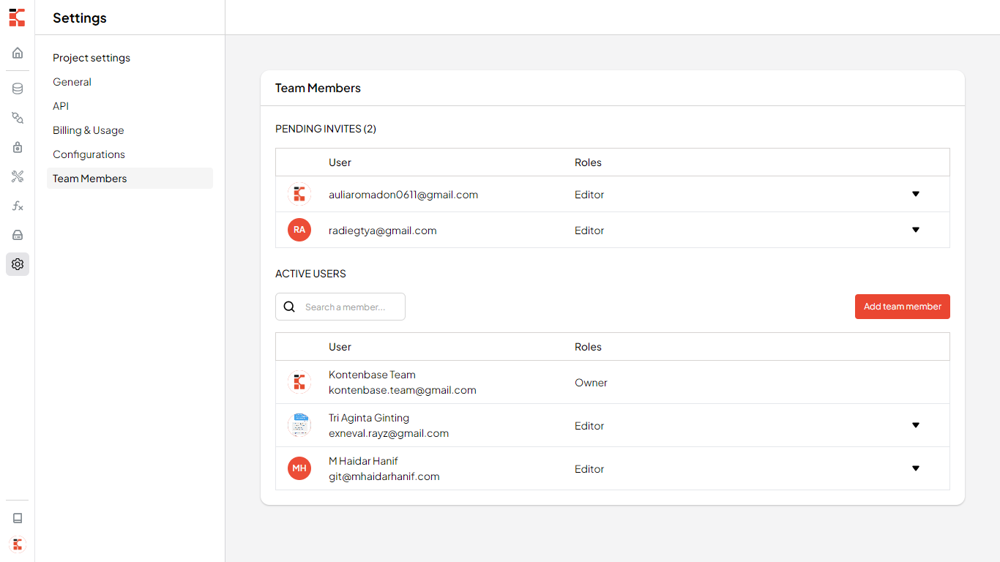
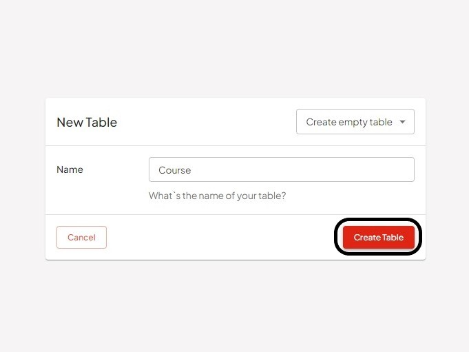
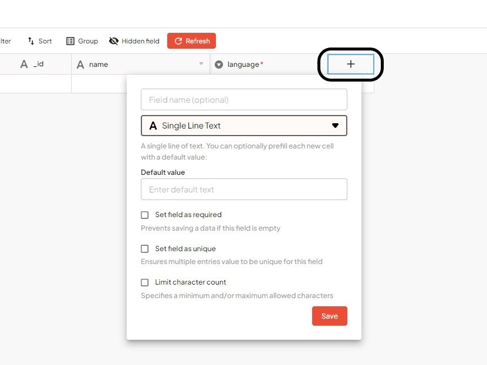
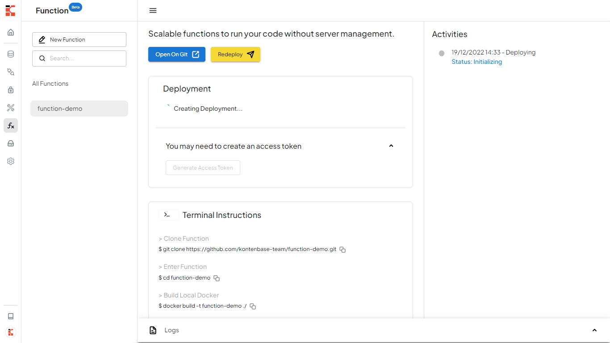

import YouTube from 'react-youtube'

<YouTube videoId="Ofqw_UH0m8c" />

# Introduction
This is Kontenbase v2, not much different from the v1 but come back with many more simple and easy ways to help developers during website app development!

Kontenbase is a low code-no code platform that allows you to create:
- Auto generated Backend API
- Object storage to organize your files and assets
- Built in basic authentication like role management without coding
- Real-time support with battle tested performance

# Kontenbase Account
To log in to Kontenbase, Kontenbase Users need to log in with GitHub Account. GitHub as code management is used to store the need for custom code in Kontenbase, Function.

You can also directly connect your existing project to your GitHub and adjust the data model in Kontenbase. So, it is easy to use and does not much time needed to re-create your project in Kontenbase.

# Organization
Organizations are a way to group your projects. Each organization can be configured with different team members and billing settings.

Here, you can see a list of applications that you and your teams are currently developing or add new projects that you are about to develop.

## Team Members 
You can invite your team members into your organizations to collaborate on projects.

You can also assign roles to your team members with different access levels. The table below shows the corresponding permissions for each available role in the Dashboard.

| Permissions      | Owner  | Editor  | Developer  | Viewer  |
| ---------------- | -------| --------| -----------| --------|
| TBD              | [X]    | [X]     |     [X]    | [X]     |

# Project
The projects are organized based on Organization.

You are free to name the project and rename it in the project settings, once created.

## Create a project
Let's create an `Online Course App` as study case.

1. Go to app.kontenbase.com .
2. Click on "New Project".

3. Enter your project name and click "Create Project".

4. Wait for the project to launch.

Home page will show the auto-generated URL and APIKey for the project. Scroll down to see the project examples provided here and you can directly try these examples.

## Database
The Database Menu lets you create and organize the tables, including data modeling and relational table.
By default, there is Users Table for Authentication where you can also customize the field.

1. Hover to "Database" Menu.
2. Click on "New Table".

3. Enter your table name and click "Create Table".

4. Customize data structure.

    ### Edit field
      1. Click on the down triangle icon and select "Customize field type".

      

      2. Adjust field type to project need.
      
      

      In this case, the "Single Select" type will let you list the name of options. For more "Data Modeling" type explanations, read more [here.](https://docs.kontenbase.com/overview/data-types)

      
      
      3. Set field as required or unique.
      
      
      
      4. Click on "Save" Button.
      
      
      
      5. Click on "Confirm" from the confirmation dialog to save the change.
      
      

    ### Add field
      1. Click on "Add Button (+)".
      
      
      
      2. Adjust field type to the project need.
      
      
      
      "Attachment" is used for Single or Multiple Uploads.

      3. Set field as required or unique.
            
      4. Click on "Save". 
      
      

    ### Relational table
      1. Add field using Add Button (+).

      

      2. Select "Link To Record" type to create a "relational table".
      
      

      3. Click the "Select table" field and choose the table.
      
      

      4. Click the "Field name (optional)" field and name the field.

      

      You are able to disable "Allow linking to multiple records".

      5. Click "Save" button.

      

    ### Entry data
      1. Double-click on the column to fill the row.

      

      Then click enter or hover cursor to any area to save the record.

      

      2. Add record by Add Button (+).

      

      Fill in the field then click the "Save" icon.

      

    ### Get data from the Relational table field

      

      

Here, the data is shown in the form of rows and columns.

## API
Every single table created will auto-generated a RESTful API.
    
### Try to GET record
  

  

  Hosted URL that can be accessed online or any API Client Platform.

  

### Authentication
    
  1. Register

  

  There will be a token for each account registered.

  2. Login

  

### Try to POST Record

  

## Authorization
The Auth Menu will give you access to control permission for each role.

## Function
Kontenbase provides The Function Menu to create custom code that is stored on your GitHub Account 
or directly import your existing project on GitHub to Kontenbase.
You are allowed to use any programming language whether it's frontend or backend.

### Import Function
Let's try to create function in Kontenbase by importing existing project in GitHub.

1. Hover over the "Function" Menu and select an existing repository synced from your GitHub Account.

2. Name your function and add any env that correlates to the project. Then, click on the "Create" Button.

3. Wait until the deployment process is complete.

- Initializing

- In Progress

- Succes

4. Once the deployment is complete, you can start viewing your existing repository and editing your code.

5. Open your Function from the hosted URL.

Result:

### Trigger CI/CD by Editing Code 

1. Make changes and save the code.

2. At the same time, Kontenbase CI/CD will initialize the changes.

3. Wait for the Update and the deployment complete.

## Storage
Easily see your uploaded file in Storage Menu. You can also upload files and assets from here and organize them based on the folder.

