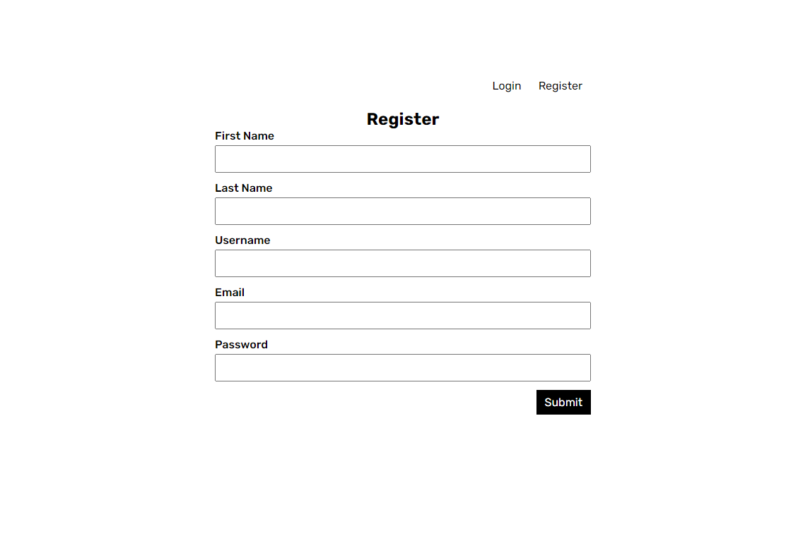

<div class='container-link'>
  <a  class='button-stackblitz' href="https://stackblitz.com/fork/github/kontenbase/quickstart-angular">
    
  </a>
  <a class='button-link button-github' href='https://github.com/kontenbase/quickstart-angular'>View source
    
  </a>
</div>

## Intro

This example will show you how to build a simple user management app from scratch using Kontenbase and Angular. Before begin make sure that you are familiar with Angular basics.

This also includes:

- Kontenbase [Database](/service/find): to store data, such as users and profiles.
- Kontenbase [SDK](/overview/sdk): this will make easier to handle auth and service features.
- Kontenbase [Authentication & Authorization](/auth/register): users can sign in with username and password.
- Kontenbase [Storage](/storage/upload): users can upload a photo.

By the end, you'll have an application that is able to register a new user, login and update some basic profile details.


## Project Set up

Before we start building we're going to set up our Database and get the API KEY.

### Create a Project

1. Go to [app.kontenbase.com](https://app.kontenbase.com)
2. Click on `Create Project` button.
3. Enter your project details.
4. Wait for the new project to launch.

### Set up the Database Service

Now we are going to set `profile` and `Users` service.

1. Click on `Create New Service` button.
2. Fill in the service detail, give a name `profile`, select as private.
3. Click on `profile` service, select`Customize Fields`, then add some fields following picture below. note, there is a field `Users` with data type `Link To Record`. It means we create a data relation between the service `profile` with the `Users`.


We need some configuration in `Users` service to make both autheticated user and public can get or access users data. But don't worry, by default that will not return password, so user still secure.

1. Click on `Authorization` button.
2. Change service to `Users` and turn on `GET` permission for role autheticated and public.


3. Add new field called : `username`, select data type : `username`, then set field as required and unique.
4. Enable username as user identity when logging in: click `Settings`, then `Configuration` on the sidebar, find `User identity field` and change to username.

### Get the API KEY

1. Go to the `Settings`.
2. Click `API` on the sidebar.
3. Find your API KEY in this page.

### Building the App

#### Initialize an Angular App

We can use the Angular CLI to initialize an app called kontenbase-angular:

```cmd
npx ng new kontenbase-angular --routing true --style css
cd kontenbase-angular
```

Let's install Kontenbase SDK, simply use the command below:

```
npm install @kontenbase/sdk
```

Save the API KEY to environment variable in a `environments/environment.ts` that you copied earlier.

```cmd title="/src/environments/environment.ts"
export const environment = {
  production: false,
  kontenbaseApiKey: YOUR_API_KEY,
};
```

Once that is done, let's create a helper file to initialize the Kontenbase Client and configure your SDK with the API KEY:

```js title="/app/src/kontenbase.service.ts"
import { Injectable } from '@angular/core';
import { createClient } from '@kontenbase/sdk';
import { environment } from '../environments/environment';

interface Profile {
  company?: string;
  location?: string;
  position?: string;
  website?: string;
}

@Injectable({ providedIn: 'root' })
export class KontenbaseService {
  private kontenbase: any;

  constructor() {
    this.kontenbase = createClient({
      apiKey: environment.kontenbaseApiKey,
    });
  }

  get user() {
    return this.kontenbase.auth.user();
  }

  login(username: string, password: string) {
    return this.kontenbase.auth.login({
      // @ts-ignore
      username,
      password,
    });
  }

  register(
    firstName: string,
    lastName: string,
    email: string,
    username: string,
    password: string
  ) {
    return this.kontenbase.auth.register({
      firstName,
      lastName,
      email,
      // @ts-ignore
      username,
      password,
    });
  }

  createProfile(userId: string) {
    return this.kontenbase.service('profile').create({
      Users: [userId],
    });
  }

  getOwnProfile() {
    return this.kontenbase.auth.user({
      lookup: '*',
    });
  }

  updateUser(firstName: string, lastName: string, phoneNumber: string) {
    return this.kontenbase.auth.update({ firstName, lastName, phoneNumber });
  }

  uploadImage(file: string) {
    return this.kontenbase.storage.upload(file);
  }

  updateImage(profileId: string, image: string | undefined) {
    return this.kontenbase.service('profile').updateById(profileId, {
      image,
    });
  }

  updateProfile(
    id: string,
    company: string,
    location: string,
    position: string,
    website: string
  ) {
    let profileData: Profile = {
      company: '',
      location: '',
      position: '',
    };
    profileData.company = company;
    profileData.location = location;
    profileData.position = position;

    if (website !== '') {
      profileData.website = website;
    }

    return this.kontenbase.service('profile').updateById(id, profileData);
  }

  getProfileByUsername(username: string | undefined) {
    return this.kontenbase.service('Users').find({
      where: {
        username,
      },
      lookup: '*',
    });
  }

  logout() {
    return this.kontenbase.auth.logout();
  }
}
```

also import angular features that we will need, copy the code below:

```ts title='/src/app/app.module.ts'
import { NgModule } from '@angular/core';
import { FormsModule, ReactiveFormsModule } from '@angular/forms';
import { BrowserModule } from '@angular/platform-browser';
import { AppRoutingModule } from './app-routing.module';
import { AppComponent } from './app.component';

@NgModule({
  declarations: [AppComponent],
  imports: [BrowserModule, AppRoutingModule, FormsModule, ReactiveFormsModule],
  providers: [],
  bootstrap: [AppComponent],
})
export class AppModule {}
```

then create routing for our App.

```ts title='/src/app/app-routing.module.ts'
import { NgModule } from '@angular/core';
import { RouterModule, Routes } from '@angular/router';

const routes: Routes = [];

@NgModule({
  imports: [RouterModule.forRoot(routes)],
  exports: [RouterModule],
})
export class AppRoutingModule {}
```

Remove all code inside `app.component.html` leave only `<router-outlet></router-outlet>` tag.

```html title='/src/app/app.component.html'
<router-outlet></router-outlet>
```

An optional step is updating the CSS file to make the App look nice. copy the css code that we have provided below to `styles.css`:

```css title='/src/styles.css'
@import url('https://fonts.googleapis.com/css2?family=Rubik:wght@300;400;500;600;700&display=swap');

* {
  margin: 0;
  padding: 0;
  box-sizing: border-box;
  font-family: 'Rubik', sans-serif;
}
a {
  text-decoration: none;
}
button,
.button {
  color: black;
  background-color: transparent;
  border: none;
  padding: 8px 12px;
  font-size: 16px;
  cursor: pointer;
}
.button-ouline {
  border: 1px solid gainsboro;
}
.button-primary {
  background-color: black;
  color: white;
}
.auth-page {
  margin: 0 auto;
  width: 560px;
  padding: 14px;
}
.auth-button {
  text-align: right;
  margin-bottom: 16px;
}
.auth-page h2 {
  text-align: center;
}
.form-group {
  margin-bottom: 12px;
  font-size: 16px;
}
.form-group label {
  display: block;
  margin-bottom: 4px;
  font-weight: 500;
  font-size: 16px;
  text-align: left;
}
.form-group input {
  padding: 8px 12px;
  width: 100%;
  font-size: 16px;
}
.form-button {
  text-align: right;
}
.profile-page {
  margin: 0 auto;
  width: 560px;
}
.profile-wrapper {
  background-color: black;
  padding: 14px;
  color: white;
}
.profile-header {
  text-align: center;
  padding: 24px 0;
}
.profile-title {
  margin: 8px 0;
  font-size: 24px;
  font-weight: 600;
  text-transform: capitalize;
}
.image-avatar {
  border-radius: 50px;
}
.card {
  background-color: white;
  color: black;
  border-radius: 2px;
  padding: 14px;
}
.card:not(:last-child) {
  margin-bottom: 12px;
}
.card h3 {
  font-weight: 500;
  margin-bottom: 24px;
}
.card-field:not(:last-child) {
  margin-bottom: 12px;
}
.card-field input {
  font-size: 16px;
}
.card span,
.card label {
  display: block;
  font-size: 14px;
  color: gray;
  margin-bottom: 4px;
}
.card input {
  display: block;
  font-family: 16px;
  padding: 8px 8px 8px 0;
  color: black;
  width: 100%;
  border: none;
  border-bottom: 1px solid gainsboro;
  outline: none;
}
.website-link {
  text-decoration: none;
  color: black;
}
.logout-button {
  text-align: end;
}
input[type='file'] {
  display: none;
}
.label-file {
  display: flex;
  flex-direction: column;
  align-items: center;
  margin-top: 2px;
  cursor: pointer;
}
.label-file span {
  margin-top: 10px;
}
.button-top {
  display: flex;
  justify-content: space-between;
}
.link-email {
  text-decoration: none;
  color: black;
}
```

#### Set up Login and Register Components

Let's set up the angular components to manage login and register. We'll use username and password to login.

Create a folder which will be called `parts`, then create `login.component.ts` and `register.component.ts` file inside that folder and copy the code below in each files.

```js title='/src/app/parts/login.component.ts'
import { Component } from '@angular/core';
import { Router } from '@angular/router';
import { KontenbaseService } from '../kontenbase.service';

@Component({
  selector: 'login',
  template: `
    <form>
      <input type="hidden" name="operation" value="login" />
      <div class="form-group">
        <label>Username</label>
        <input #username type="text" name="username" required />
      </div>
      <div class="form-group">
        <label>Password</label>
        <input #password type="password" name="password" required />
      </div>
      <div class="form-button">
        <button
          type="submit"
          (click)="handleLogin(username.value, password.value)"
          class="button button-primary"
        >
          Submit
        </button>
      </div>
    </form>
  `,
})
export class LoginComponent {
  constructor(
    private readonly kontenbase: KontenbaseService,
    private router: Router
  ) {}

  handleLogin = async (username: string, password: string) => {
    const { error, token } = await this.kontenbase.login(username, password);

    if (error) {
      alert(error.message);
      return;
    }

    if (token) {
      this.router.navigate(['/profile']);
    }
  };
}
```

```js title='/src/app/parts/register.component.ts'
import { Component } from '@angular/core';
import { Router } from '@angular/router';
import { KontenbaseService } from '../kontenbase.service';

@Component({
  selector: 'register',
  template: `
    <form>
      <div class="form-group">
        <label>First Name</label>
        <input #firstName type="text" name="firstname" required />
      </div>
      <div class="form-group">
        <label>Last Name</label>
        <input #lastName type="text" name="lastname" />
      </div>
      <div class="form-group">
        <label>Username</label>
        <input #username type="text" name="username" required />
      </div>
      <div class="form-group">
        <label>Email</label>
        <input #email type="email" name="email" required />
      </div>
      <div class="form-group">
        <label>Password</label>
        <input #password type="password" name="password" required />
      </div>
      <div class="form-button">
        <button
          (click)="
            handleRegister(
              firstName.value,
              lastName.value,
              email.value,
              username.value,
              password.value
            )
          "
          class="button button-primary"
        >
          Submit
        </button>
      </div>
    </form>
  `,
})
export class RegisterComponent {
  constructor(
    private readonly kontenbase: KontenbaseService,
    private router: Router
  ) {}

  handleRegister = async (
    firstName: string,
    lastName: string,
    email: string,
    username: string,
    password: string
  ) => {
    const { user, error } = await this.kontenbase.register(
      firstName,
      lastName,
      email,
      username,
      password
    );

    if (error) {
      alert(error.message);
      return;
    }

    const { error: errorProfile } = await this.kontenbase.createProfile(
      user._id
    );

    if (errorProfile) {
      alert(errorProfile.message);
      return;
    }

    this.router.navigate(['/profile']);
  };
}
```

Create `home.component.ts` file inside the `app` folder, this will import `login` and `register` components. Copy the code below:

```ts title='/src/app/home.component.ts'
import { Component } from '@angular/core';

@Component({
  template: `
    <div class="auth-page">
      <div class="auth-button">
        <button (click)="setSwitchAuthForm('login')">Login</button>
        <button (click)="setSwitchAuthForm('register')">Register</button>
        <div>
          <login *ngIf="switchAuthForm === 'login'"></login>
          <register *ngIf="switchAuthForm === 'register'"></register>
        </div>
      </div>
    </div>
  `,
})
export class HomeComponent {
  switchAuthForm = 'login';

  setSwitchAuthForm(authName: string) {
    this.switchAuthForm = authName;
  }
}
```

then declaration `login`, `register` and `home` components :

```ts title='/src/app/app.module.ts'
import { NgModule } from '@angular/core';
import { FormsModule, ReactiveFormsModule } from '@angular/forms';
import { BrowserModule } from '@angular/platform-browser';
import { AppRoutingModule } from './app-routing.module';
import { AppComponent } from './app.component';
// highlight-start
import { LoginComponent } from './parts/login.component';
import { RegisterComponent } from './parts/register.component';
import { HomeComponent } from './home.component';
// highlight-end

@NgModule({
  declarations: [
    AppComponent,
    // highlight-start
    LoginComponent,
    RegisterComponent,
    HomeComponent,
    // highlight-end
  ],
  imports: [BrowserModule, AppRoutingModule, FormsModule, ReactiveFormsModule],
  providers: [],
  bootstrap: [AppComponent],
})
export class AppModule {}
```

Create a route for Home page.

```ts title='/src/app/app-routing.module.ts'
import { NgModule } from '@angular/core';
import { RouterModule, Routes } from '@angular/router';
// highlight-start
import { HomeComponent } from './home.component';
// highlight-end

const routes: Routes = [
  // highlight-start
  {
    path: '',
    component: HomeComponent,
  },
  // highlight-end
];
```

If we launch the App after doing the steps above, We'll see this page show:



#### Set up Profile Page

To view and edit our profile, let's create `edit-profile.component.ts` file inside the `app` folder, then copy the code below:

```js title='/src/app/edit-profile.component.ts'
import { Component, OnInit } from '@angular/core';
import { Router } from '@angular/router';
import { KontenbaseService } from './kontenbase.service';

@Component({
  template: `
    <div class="profile-page">
      <div class="button-top">
        <a [routerLink]="'/' + user.username" class="button">View Profile</a>
        <button (click)="handleLogout()">Logout</button>
      </div>
      <div class="profile-wrapper">
        <div class="profile-header">
          <label class="label-file" for="file">
            
            <span>{{ loading ? 'Uploading...' : 'Change Image' }}</span>
          </label>
          <input
            name="file"
            id="file"
            type="file"
            accept="image/*"
            (change)="handleChangeImage($event)"
          />
        </div>
        <div class="card">
          <form method="post">
            <div class="card-field">
              <label>First Name</label>
              <input
                #firstName
                type="text"
                name="firstname"
                [value]="user?.firstName ?? ''"
              />
            </div>
            <div class="card-field">
              <label>Last Name</label>
              <input
                #lastName
                type="text"
                name="lastname"
                [value]="user?.lastName ?? ''"
              />
            </div>
            <div class="card-field">
              <label>Phone Number</label>
              <input
                #phoneNumber
                type="text"
                name="phonenumber"
                [value]="user?.phoneNumber ?? ''"
              />
            </div>
            <div class="card-field">
              <label>Company</label>
              <input
                #company
                type="text"
                name="company"
                [value]="profile?.company ?? ''"
              />
            </div>
            <div class="card-field">
              <label>Position</label>
              <input
                #position
                type="text"
                name="position"
                [value]="profile?.position ?? ''"
              />
            </div>
            <div class="card-field">
              <label>Location</label>
              <input
                #location
                type="text"
                name="location"
                [value]="profile?.location ?? ''"
              />
            </div>
            <div class="card-field">
              <label>Website</label>
              <input
                #website
                type="url"
                name="website"
                [value]="profile?.website ?? ''"
              />
            </div>
            <div class="form-button">
              <button
                type="submit"
                (click)="
                  handleUpdate(
                    firstName.value,
                    lastName.value,
                    phoneNumber.value,
                    company.value,
                    location.value,
                    position.value,
                    website.value
                  )
                "
                class="button button-primary"
              >
                Update
              </button>
            </div>
          </form>
        </div>
      </div>
    </div>
  `,
})
export class EditProfileComponent implements OnInit {
  user: any;
  profile: any;
  loading = false;

  constructor(
    private readonly kontenbase: KontenbaseService,
    private router: Router
  ) {}

  ngOnInit() {
    this.getProfile();
  }

  getProfile = async () => {
    const { error, user } = await this.kontenbase.getOwnProfile();

    if (error) {
      console.log(error);
      return;
    }

    if (user) {
      this.user = user;
      this.profile = user.profile[0];
    }
  };

  handleChangeImage = async (event: any) => {
    this.loading = true;
    const file = event.target.files[0];
    const { data, error: uploadError } = await this.kontenbase.uploadImage(
      file
    );

    const { error: updateError } = await this.kontenbase.updateImage(
      this.profile._id,
      data?.url
    );

    if (uploadError || updateError) {
      alert('Failed to change image profile');
      return;
    }

    this.profile.image = data?.url;
    this.loading = false;
  };

  handleUpdate = async (
    firstName: string,
    lastName: string,
    phoneNumber: string,
    company: string,
    location: string,
    position: string,
    website: string
  ) => {
    const { error: userError } = await this.kontenbase.updateUser(
      firstName,
      lastName,
      phoneNumber
    );

    const { error: profileError } = await this.kontenbase.updateProfile(
      this.profile._id,
      company,
      position,
      location,
      website
    );

    if (userError || profileError) {
      alert('Failed to update profile');
    } else {
      alert('Profile updated!');
    }
  };

  handleLogout = async () => {
    await this.kontenbase.logout();
    this.router.navigate(['/']);
  };
}
```

declaration and Create a route for Edit Profile page.

```ts title='/src/app/app-routing.module.ts'
import { NgModule } from '@angular/core';
import { RouterModule, Routes } from '@angular/router';
import { HomeComponent } from './home.component';
// highlight-start
import { EditProfileComponent } from './edit-profile.component';
// highlight-end

const routes: Routes = [
  {
    path: '',
    component: HomeComponent,
  },
  // highlight-start
  {
    path: 'profile',
    component: EditProfileComponent,
  },
  // highlight-end
];

@NgModule({
  imports: [RouterModule.forRoot(routes)],
  exports: [RouterModule],
})
export class AppRoutingModule {}
```

```ts title='/src/app/app.module.ts'
import { NgModule } from '@angular/core';
import { FormsModule, ReactiveFormsModule } from '@angular/forms';
import { BrowserModule } from '@angular/platform-browser';
import { AppRoutingModule } from './app-routing.module';
import { AppComponent } from './app.component';
import { LoginComponent } from './parts/login.component';
import { RegisterComponent } from './parts/register.component';
import { HomeComponent } from './home.component';
// highlight-start
import { EditProfileComponent } from './edit-profile.component';
// highlight-end

@NgModule({
  declarations: [
    AppComponent,
    LoginComponent,
    RegisterComponent,
    HomeComponent,
    // highlight-start
    EditProfileComponent,
    // highlight-end
  ],
  imports: [BrowserModule, AppRoutingModule, FormsModule, ReactiveFormsModule],
  providers: [],
  bootstrap: [AppComponent],
})
export class AppModule {}
```

If we register or login successfully we should be navigated to `Profile` page. In this page we will able to edit profile and upload a picture.


#### Set up View Profile Based on the Username

Now we will create a page to show user profile based on the username defined in the URL. Example when user visit: `app_url/johndoe`,
this page will show user profile with username `johndoe`.

Create `profile.component.ts` file inside the `app` folder, Copy the code below:

```ts title='/src/app/profile.component.ts'
import { Component, OnInit } from '@angular/core';
import { ActivatedRoute, Router } from '@angular/router';
import { KontenbaseService } from './kontenbase.service';

@Component({
  template: `
    <div class="profile-page">
      <div *ngIf="isOwnProfile" class="button-top">
        <a routerLink="/profile" class="button">Edit Profile</a>
        <button (click)="handleLogout()">Logout</button>
      </div>
      <div class="profile-wrapper">
        <div class="profile-header">
          
          <h3 class="profile-title">
            <span>{{ user.firstName }}</span> <span>{{ user.lastName }}</span>
          </h3>
          <p>{{ profile.position || 'position is null' }}</p>
        </div>
        <div class="card">
          <h3>Contact</h3>
          <div class="card-field">
            <span>Name</span>
            <p>{{ user.firstName }} {{ user.lastName }}</p>
          </div>
          <div class="card-field">
            <span>Mobile</span>
            <p>{{ profile.phoneNumber || 'phone number is null' }}</p>
          </div>
          <div class="card-field">
            <span>Email</span>
            <a class="link-email" :href="'mailto:' + email">
              {{ user.email || 'email is null' }}
            </a>
          </div>
          <div class="card-field">
            <span>Company</span>
            <p>{{ profile.company || 'company is null' }}</p>
          </div>
        </div>
        <div class="card">
          <h3>Location</h3>
          <p>{{ profile.location || 'location is null' }}</p>
        </div>
        <div class="card">
          <h3>Web Links</h3>
          <a class="website-link" href="{{ profile.website || '' }}">
            Website
          </a>
        </div>
      </div>
    </div>
  `,
})
export class ProfileComponent implements OnInit {
  username: string | undefined;
  user: any;
  profile: any;
  isOwnProfile = false;

  constructor(
    private readonly kontenbase: KontenbaseService,
    private router: Router,
    private route: ActivatedRoute
  ) {}

  ngOnInit() {
    this.username = this.route.snapshot.paramMap.get('username') || undefined;
    this.getProfile();
  }

  getProfile = async () => {
    const { data: userProfile, error } =
      await this.kontenbase.getProfileByUsername(this.username);

    if (error) {
      console.log(error);
      return;
    }

    const { user: authUser } = await this.kontenbase.getOwnProfile();

    if (userProfile) {
      this.user = userProfile[0];
      this.profile = userProfile[0].profile[0];
      this.isOwnProfile = this.user.username === authUser.username;
    }
  };

  handleLogout = async () => {
    await this.kontenbase.logout();
    this.router.navigate(['/']);
  };
}
```

Finally, declaration and create a route for this page.

```ts title='/src/app/app-routing.module.ts'
import { NgModule } from '@angular/core';
import { RouterModule, Routes } from '@angular/router';
import { HomeComponent } from './home.component';
import { EditProfileComponent } from './edit-profile.component';
//highlight-start
import { ProfileComponent } from './profile.component';
//highlight-end

const routes: Routes = [
  {
    path: '',
    component: HomeComponent,
  },
  {
    path: 'profile',
    component: EditProfileComponent,
  },
  //highlight-start
  {
    path: ':username',
    component: ProfileComponent,
  },
  //highlight-end
];

@NgModule({
  imports: [RouterModule.forRoot(routes)],
  exports: [RouterModule],
})
export class AppRoutingModule {}
```

```ts title='/src/app/app.module.ts'
import { NgModule } from '@angular/core';
import { FormsModule, ReactiveFormsModule } from '@angular/forms';
import { BrowserModule } from '@angular/platform-browser';
import { AppRoutingModule } from './app-routing.module';
import { AppComponent } from './app.component';
import { LoginComponent } from './parts/login.component';
import { RegisterComponent } from './parts/register.component';
import { HomeComponent } from './home.component';
import { EditProfileComponent } from './edit-profile.component';
//highlight-start
import { ProfileComponent } from './profile.component';
//highlight-end

@NgModule({
  declarations: [
    AppComponent,
    LoginComponent,
    RegisterComponent,
    HomeComponent,
    EditProfileComponent,
    //highlight-start
    ProfileComponent,
    //highlight-end
  ],
  imports: [BrowserModule, AppRoutingModule, FormsModule, ReactiveFormsModule],
  providers: [],
  bootstrap: [AppComponent],
})
export class AppModule {}
```

And we're done to complete our App!
