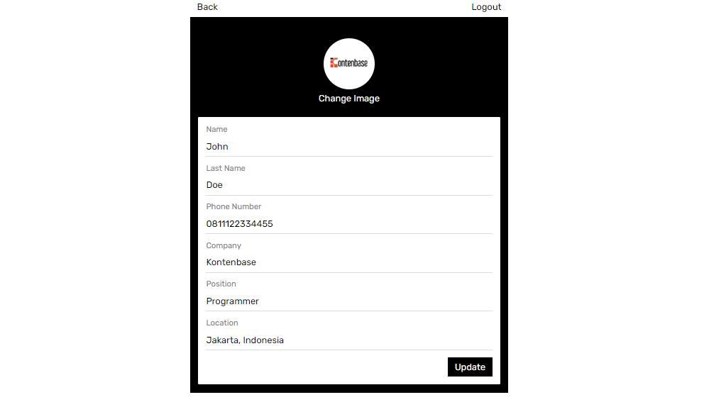
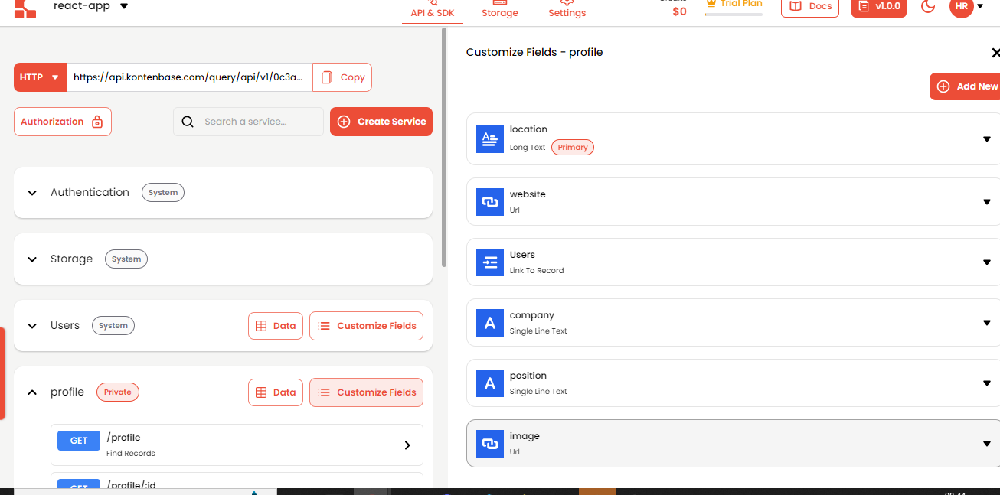
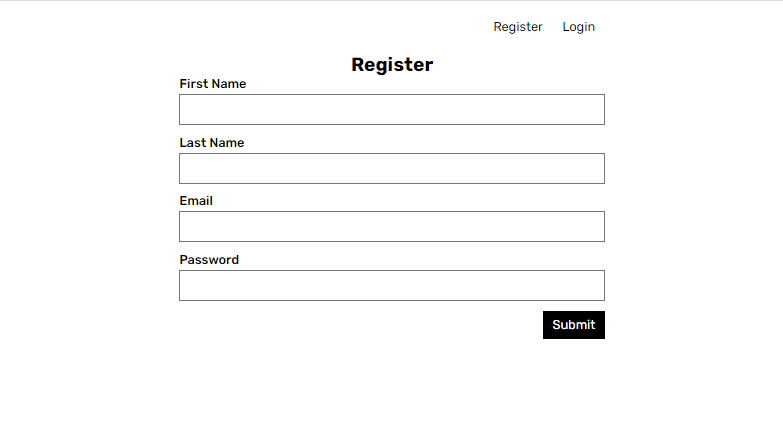

## Intro
This example provides the steps to build a simple user management app (from scratch!) using Kontenbase and React. It includes:
- Kontenbase Database: to store data, such as user and profile .
- Kontenbase SDK: it will make easier to handle auth and service features. 
- Kontenbase Authentication & Authorization: users can sign in with email and password.
- Kontenbase Storage: users can upload a photo.
- Row Level Security:  protected so that individuals can only access their own data.

By the end of this guide you'll have an app which allows users to login and update some basic profile details:



## Project set up
Before we start building we're going to set up our Database and get API KEY.

### Create a project
1. Go to [app.kontenbase.com](https://app.kontenbase.com) 
2. Click on "Create Project".
3. Enter your project details.
4. Wait for the new project to launch.

### Set up the database service
Now we are going to set 'profile' service.
1. Click button `create new service` .
2. fill in the service detail, give a name 'profile', select as private.
3. Customize Fields following picture below. note, there is a field `Users` with data type `link to record`. it means we create a data relation between the service profile with the user.




### Get the API Keys
1. Go to the "Settings".
2. Click "API" in the sidebar.
3. Find your API KEY in this page.

### Building the App
Let's start building the React app from scratch.

#### Initialize a React app
We can use Create React App to initialize an app called kontenbase-react:
```cmd
npx create-react-app kontenbase-react
cd kontenbase-react
```
let's install additional dependency react-router-dom and kontenbase SDK,  simply use the command below:

```
npm install react-router-dom
npm install @kontenbase/sdk

```
save the KEY API environment variables in a `.env` file.

```cmd title=".env"

REACT_APP_KONTENBASE_API_KEY=YOUR_API_KEY
```

Once that is done, let's create a helper file to initialize the kontenbase client and configure your SDK with API Key:


```js  title="/src/lib/kontenbase.js"

import { KontenbaseClient } from '@kontenbase/sdk';

export const kontenbase = new KontenbaseClient({
  apiKey: process.env.REACT_APP_KONTENBASE_API_KEY,
});

```

And one optional step is to update the CSS file src/index.css to make the app look nice. Remove everything from the src/index.css and copy css code that we have provided here: `link`.

#### Set up a Login and Register component
Let's set up a React component to manage login and sign up. we'll use email and password to login.
create a folder inside the src folder, which will be called `pages` and `component` then create Login and Register file inside the components folder and copy the code below on each file.

```js title='/components/Login.js'

import React, { useState } from 'react';
import { useNavigate } from 'react-router-dom';
import { kontenbase } from '../lib/kontenbase';
const Login = ({ setUser }) => {
  const [email, setEmail] = useState('');
  const [password, setPassword] = useState('');

  const navigate = useNavigate();

  const handleLogin = async (e) => {
    e.preventDefault();
    const response = await kontenbase.auth.login({
      email,
      password,
    });

    if (response.status === 200) {
      setUser(response.user);
      navigate('/myaccount');
    } else {
      alert(response.error?.message);
    }
  };

  return (
    <div>
      <form onSubmit={handleLogin}>
        <h2>Login</h2>
        <div className="form-group">
          <label>Email</label>
          <input
            type="text"
            value={email}
            onChange={(e) => setEmail(e.target.value)}
          />
        </div>
        <div className="form-group">
          <label>Password</label>
          <input
            type="text"
            value={password}
            onChange={(e) => setPassword(e.target.value)}
          />
        </div>
        <div className="form-button">
          <button className="button button-primary" type="sumbit">
            Submit
          </button>
        </div>
      </form>
    </div>
  );
};

export default Login;


```

```js title='/components/Register.js'
import React, { useState } from 'react';
import { kontenbase } from '../lib/kontenbase';

const Register = ({ setSwitchAuthForm }) => {
  const [firstName, setFirstName] = useState('');
  const [lastName, setLastName] = useState('');
  const [email, setEmail] = useState('');
  const [password, setPassword] = useState('');

  const handleRegister = async (e) => {
    e.preventDefault();

    const response = await kontenbase.auth.register({
      firstName,
      lastName,
      email,
      password,
    });

    await kontenbase.service('profile').create({
      Users: [response.user?._id],
    });

    if (response.status === 200) {
      alert('register success');
      setSwitchAuthForm('login');
    } else {
      alert(response.error.message);
    }
  };

  return (
    <div>
      <form onSubmit={handleRegister}>
        <h2>Register</h2>
        <div className="form-group">
          <label>First Name</label>
          <input
            type="text"
            value={firstName}
            onChange={(e) => setFirstName(e.target.value)}
          />
        </div>
        <div className="form-group">
          <label>Last Name</label>
          <input
            type="text"
            value={lastName}
            onChange={(e) => setLastName(e.target.value)}
          />
        </div>
        <div className="form-group">
          <label>Email</label>
          <input
            type="text"
            value={email}
            onChange={(e) => setEmail(e.target.value)}
          />
        </div>
        <div className="form-group">
          <label>Password</label>
          <input
            type="text"
            value={password}
            onChange={(e) => setPassword(e.target.value)}
          />
        </div>

        <div className="form-button">
          <button className="button button-primary" type="sumbit">
            Submit
          </button>
        </div>
      </form>
    </div>
  );
};

export default Register;

```

 create Auth.js file inside the pages folder, then copy code below: 

```js title='/src/pages/Auth.js'
import React, { useState, useEffect } from 'react';
import Login from '../components/Login';
import Register from '../components/Register';
import { kontenbase } from '../lib/kontenbase';
import { useNavigate } from 'react-router-dom';
const Auth = () => {
  const [switchAuthForm, setSwitchAuthForm] = useState('register');
  const [user, setUser] = useState();
  const navigate = useNavigate();
  useEffect(() => {
    getUser();
    if (user) {
      navigate('myaccount');
    }
  }, [user]);

  const getUser = async () => {
    const response = await kontenbase.auth.user();
    setUser(response?.user);
  };

  return (
    <div className="auth-page">
      <div className="auth-button">
        <button onClick={() => setSwitchAuthForm('register')}>Register</button>
        <button onClick={() => setSwitchAuthForm('login')}>Login</button>
      </div>

      {switchAuthForm === 'register' ? (
        <Register setSwitchAuthForm={setSwitchAuthForm} />
      ) : (
        <Login setUser={setUser} />
      )}
    </div>
  );
};

export default Auth;

```


create route for Auth page, then launch app.

```js title='app.js'

import React from 'react';
import './App.css';
import { Route, Routes, BrowserRouter } from 'react-router-dom';
import Auth from './pages/Auth';
function App() {
  return (
    <BrowserRouter>
      <Routes>
        <Route path="/" element={<Auth />} />
      </Routes>
    </BrowserRouter>
  );
}

export default App;

```

This is what we will see after doing the steps above



#### Setup Profile page

create file Account.js inside the pages folder. then copy code below:

```js title='/pages/Account.js'
import React, { useEffect, useRef, useState } from 'react';
import { kontenbase } from '../lib/kontenbase';
import { useNavigate } from 'react-router-dom';
const Account = () => {
  const [user, setUser] = useState();
  const [shareProfile, setShareProfile] = useState('');
  const navigate = useNavigate();
  useEffect(() => {
    getUser();
  }, []);

  const getUser = async () => {
    const response = await kontenbase.auth.user({
      lookup: '*', //this will show all linked data with user
    });
    setUser(response?.user);
    setShareProfile(
      'http://localhost:3000/profile/' + response.user?.profile[0]._id
    );
  };

  const handleLogout = async () => {
    const response = await kontenbase.auth.logout();
    if (response.status === 200) {
      navigate('/');
    }
  };

  const handleShareProfile = (e) => {
    e.preventDefault();
    navigator.clipboard.writeText(shareProfile);
    alert('Link Copied!');
  };

  if (!user) {
    return (
      <div className="not-autheticated">
        <p>Your Are not autheticated!</p>
        <button onClick={() => navigate('/')} className="button button-primary">
          Login
        </button>
      </div>
    );
  }

  return (
    <div className="profile-page">
      <div className="button-top">
        <button onClick={() => navigate('/edit-account')}>Edit Profile</button>
        <button onClick={() => handleLogout()}>Logout</button>
      </div>
      <div className="profile-wrapper">
        <div className="profile-header">
          
          <h3 className="profile-title">
            <span>{user?.firstName}</span>
            {user?.lastName ? <span> {user?.lastName}</span> : ''}
          </h3>
          <p>
            {user?.profile[0]?.position ? user?.profile[0]?.position : 'null'}
          </p>
        </div>
        <div className="card">
          <div className="share-contact">
            <button
              className="button-share"
              onClick={(e) => handleShareProfile(e)}
            >
              Share
            </button>
          </div>
          <h3>Contact</h3>
          <div className="card-field">
            <span>Name</span>
            <p>
              {user?.firstName}
              {user?.lastName ? ' ' + user?.lastName : ''}
            </p>
          </div>
          <div className="card-field">
            <span>Mobile</span>
            <p>{user?.phoneNumber ? user?.phoneNumber : 'null'}</p>
          </div>
          <div className="card-field">
            <span>Email</span>
            <a className="link-email" href="mailto:name@email.com">
              {' '}
              {user?.email}
            </a>
          </div>
          <div className="card-field">
            <span>Company</span>
            <p>
              {user?.profile[0]?.company ? user?.profile[0]?.company : 'null'}
            </p>
          </div>
        </div>
        <div className="card">
          <h3>Location</h3>
          <p>{user?.profile[0]?.location}</p>
        </div>
        <div className="card">
          <h3>Web Links</h3>
          <a
            className="website-link"
            href={
              user?.profile[0]?.website ? user?.profile[0]?.website : 'null'
            }
          >
            Website
          </a>
        </div>
      </div>
    </div>
  );
};

export default Account;

```
create route for Account page.

```js
import React from 'react';
import './App.css';
import { Route, Routes, BrowserRouter } from 'react-router-dom';
import Auth from './pages/Auth';
// highlight-start
import Account from './pages/Account';
// highlight-end

function App() {
  return (
    <BrowserRouter>
      <Routes>
        <Route path="/" element={<Auth />} />
        // highlight-start
        <Route path="/myaccount" element={<Account />} />
        // highlight-end
      </Routes>
    </BrowserRouter>
  );
}

export default App;

```
if we register and login successfully  we should be in the `Account` page.  but there is a little problem, because some field will show null. let's update data by adding edit account page:
```js title='pages/EditAccount.js'

import React, { useEffect, useState } from 'react';
import { kontenbase } from '../lib/kontenbase';
import { useNavigate } from 'react-router-dom';
const EditAccount = () => {
  const [profileId, setProfileId] = useState('');
  const [firstName, setFirstName] = useState('');
  const [lastName, setLastName] = useState('');
  const [phoneNumber, setphoneNumber] = useState('');
  const [company, setCompany] = useState('');
  const [position, setPosition] = useState('');
  const [location, setLocation] = useState('');
  const [loading, setLoading] = useState(false);
  const [image, setImage] = useState('');

  const navigate = useNavigate();

  useEffect(() => {
    getUser();
  }, []);

  const getUser = async () => {
    const { user, error } = await kontenbase.auth.user({
      lookup: '*',
    });
    const profile = user.profile[0];
    setProfileId(profile?._id);
    setFirstName(user?.firstName);
    setLastName(user?.lastName);
    setphoneNumber(user?.phoneNumber);
    setImage(profile?.image);
    setCompany(profile?.company);
    setLocation(profile?.location);
    setPosition(profile?.position);
  };

  const handleLogout = async () => {
    const response = await kontenbase.auth.logout();
    if (response.status === 200) {
      navigate('/');
    }
  };

  const handleChangeImage = async (e) => {
    setLoading(true);
    const file = e.target.files[0];
    const { data, error } = await kontenbase.storage.upload(file);

    if (error) {
      alert(error.message);
    } else {
      const response = await kontenbase
        .service('profile')
        .updateById(profileId, {
          image: data.url,
        });
      setImage(response?.data?.image);
    }
    setLoading(false);
  };

  const handleUpdate = async (e) => {
    e.preventDefault();
    const { status, error } = await kontenbase.auth.update({
      lastName,
      firstName,
      phoneNumber,
    });

    const response = await kontenbase.service('profile').updateById(profileId, {
      company,
      location,
      position,
    });

    if (status === 200) {
      alert('Update success');
      navigate('/myaccount');
    } else {
      alert(error.message);
    }
  };

  return (
    <div className="profile-page">
      <div className="button-top">
        <button className="button-back" onClick={() => navigate('/myaccount')}>
          Back
        </button>
        <button onClick={() => handleLogout()}>Logout</button>
      </div>
      <div className="profile-wrapper">
        <div className="profile-header">
          
          <div>
            <label className="label-file" htmlFor="file">
              {loading ? 'Loading...' : 'Change Image'}
            </label>
            <input
              onChange={(e) => handleChangeImage(e)}
              id="file"
              type="file"
            />
          </div>
        </div>
        <div className="card">
          <form onSubmit={handleUpdate}>
            <div className="card-field">
              <label>Name</label>
              <input
                value={firstName || ''}
                onChange={(e) => setFirstName(e.target.value)}
              />
            </div>
            <div className="card-field">
              <label>Last Name</label>
              <input
                value={lastName || ''}
                onChange={(e) => setLastName(e.target.value)}
              />
            </div>
            <div className="card-field">
              <label>Phone Number</label>
              <input
                value={phoneNumber || ''}
                onChange={(e) => setphoneNumber(e.target.value)}
              />
            </div>
            <div className="card-field">
              <label>Company</label>
              <input
                value={company || ''}
                onChange={(e) => setCompany(e.target.value)}
              />
            </div>
            <div className="card-field">
              <label>Position</label>
              <input
                value={position || ''}
                onChange={(e) => setPosition(e.target.value)}
              />
            </div>
            <div className="card-field">
              <label>Location</label>
              <input
                value={location || ''}
                onChange={(e) => setLocation(e.target.value)}
              />
            </div>

            <div className="form-button">
              <button type="submit" className="button button-primary">
                Update
              </button>
            </div>
          </form>
        </div>
      </div>
    </div>
  );
};

export default EditAccount;

```
now you will able to update data and upload picture.

