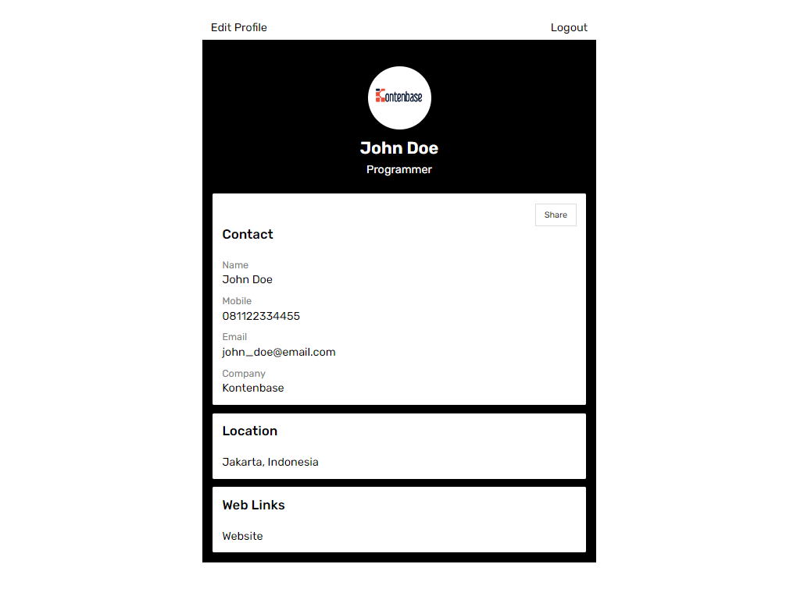
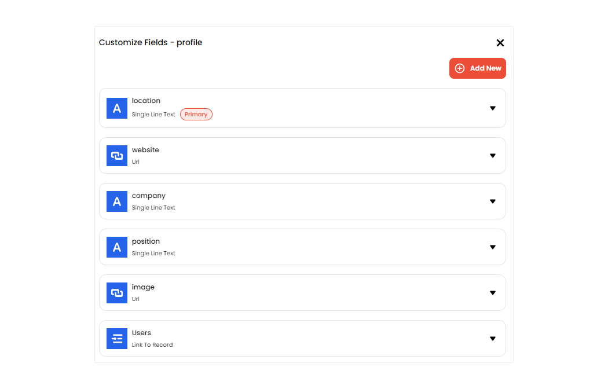
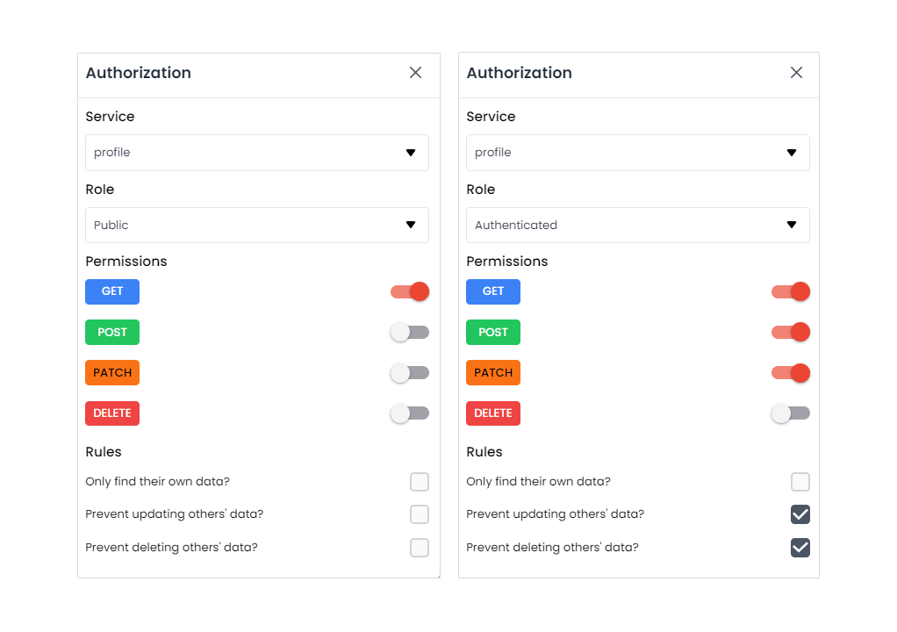
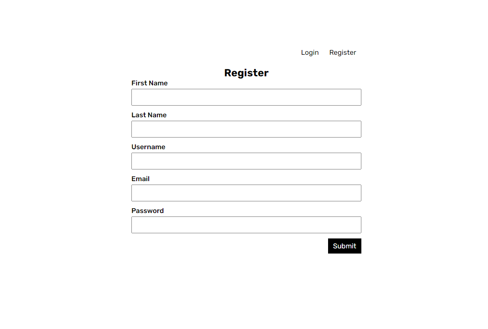
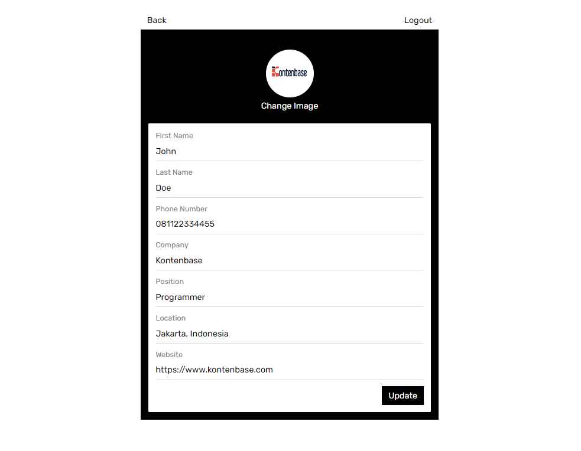

<div class='container-link'>
  <a class='button-link button-github' href='https://github.com/kontenbase/quickstart-remix'>View source
    
  </a>
</div>

## Intro

This example will show you how to build a simple user management app from scratch using Kontenbase and Remix. Before begin make sure that you are familiar with Remix basics.

This also includes:

- Kontenbase [Database](/service/find): to store data, such as users and profiles.
- Kontenbase [SDK](/overview/sdk): this will make easier to handle auth and service features.
- Kontenbase [Authentication & Authorization](/auth/register): users can sign in with username and password.
- Kontenbase [Storage](/storage/upload): users can upload a photo.

By the end, you'll have an application that is able to register a new user, login and update some basic profile details.



## Project Set up

Before we start building we're going to set up our Database and get the API KEY.

### Create a Project

1. Go to [app.kontenbase.com](https://app.kontenbase.com)
2. Click on `Create Project` button.
3. Enter your project details.
4. Wait for the new project to launch.

### Set up the Database Service

Now we are going to set `profile` and `Users` service.

1. Click on `Create New Service` button.
2. Fill in the service detail, give a name `profile`, select as private.
3. Click on `profile` service, select`Customize Fields`, then add some fields following picture below. note, there is a field `Users` with data type `Link To Record`. It means we create a data relation between the service `profile` with the `Users`.



We need some configuration in `Users` service to make both autheticated user and public can get or access users data. But don't worry, by default that will not return password, so user still secure.

1. Click on `Authorization` button.
2. Change service to `Users` and turn on `GET` permission for role autheticated and public.



3. Add new field called : `username`, select data type : `username`, then set field as required and unique.
4. Enable username as user identity when logging in: click `Settings`, then `Configuration` on the sidebar, find `User identity field` and change to username.

### Get the API KEY

1. Go to the `Settings`.
2. Click `API` on the sidebar.
3. Find your API KEY in this page.

### Building the App

#### Initialize a Remix App

We can use this command to initialize an app called kontenbase-remix:

```bash
npx create-remix@latest kontenbase-remix
```

Then choose this option when prompted:

1. What type of app do you want to create? `Just the basics`
2. Where do you want to deploy? `Remix App Server`
3. TypeScript or JavaScript? `JavaScript`
4. Do you want me to run npm install? `Yes`

navigate and open the project folder:

```bash
cd kontenbase-remix
```

Let's install Kontenbase SDK, simply use the command below:

```
npm install @kontenbase/sdk
```

Save the API KEY to environment variable in a `.env` that you copied earlier.

```cmd title=".env"
KONTENBASE_API_KEY=YOUR_KONTENBASE_API_KEY
```

Once that is done, let's create a helper file to initialize the Kontenbase Client and configure your SDK with the API KEY:

```js title="/app/lib/kontenbase.js"
import { KontenbaseClient } from '@kontenbase/sdk';

const KONTENBASE_API_KEY = process.env.KONTENBASE_API_KEY;

export const kontenbase = new KontenbaseClient({
  apiKey: KONTENBASE_API_KEY,
});

export const kontenbaseApiUrl = `https://api.kontenbase.com/query/api/v1/${KONTENBASE_API_KEY}`;
```

An optional step is adding stylesheet to make the App look nice. create folder `styles`, then create `global.css` file and copy the css code that we have provided below:

```css title='/app/styles/global.css'
@import url('https://fonts.googleapis.com/css2?family=Rubik:wght@300;400;500;600;700&display=swap');

* {
  margin: 0;
  padding: 0;
  box-sizing: border-box;
  font-family: 'Rubik', sans-serif;
}
a {
  text-decoration: none;
}
button,
.button {
  color: black;
  background-color: transparent;
  border: none;
  padding: 8px 12px;
  font-size: 16px;
  cursor: pointer;
}
.button-ouline {
  border: 1px solid gainsboro;
}
.button-primary {
  background-color: black;
  color: white;
}
.auth-page {
  margin: 0 auto;
  width: 560px;
  padding: 14px;
}
.auth-button {
  text-align: right;
  margin-bottom: 16px;
}
.auth-page h2 {
  text-align: center;
}
.form-group {
  margin-bottom: 12px;
  font-size: 16px;
}
.form-group label {
  display: block;
  margin-bottom: 4px;
  font-weight: 500;
  font-size: 16px;
}
.form-group input {
  padding: 8px 12px;
  width: 100%;
  font-size: 16px;
}
.form-button {
  text-align: right;
}
.profile-page {
  margin: 0 auto;
  width: 560px;
}
.profile-wrapper {
  background-color: black;
  padding: 14px;
  color: white;
}
.profile-header {
  text-align: center;
  padding: 24px 0;
}
.profile-title {
  margin: 8px 0;
  font-size: 24px;
  font-weight: 600;
  text-transform: capitalize;
}
.image-avatar {
  border-radius: 50px;
}
.card {
  background-color: white;
  color: black;
  border-radius: 2px;
  padding: 14px;
}
.card:not(:last-child) {
  margin-bottom: 12px;
}
.card h3 {
  font-weight: 500;
  margin-bottom: 24px;
}
.card-field:not(:last-child) {
  margin-bottom: 12px;
}
.card-field input {
  font-size: 16px;
}
.card span,
.card label {
  display: block;
  font-size: 14px;
  color: gray;
  margin-bottom: 4px;
}
.card input {
  display: block;
  font-family: 16px;
  padding: 8px 8px 8px 0;
  color: black;
  width: 100%;
  border: none;
  border-bottom: 1px solid gainsboro;
  outline: none;
}
.website-link {
  text-decoration: none;
  color: black;
}
.logout-button {
  text-align: end;
}
input[type='file'] {
  display: none;
}
.label-file {
  display: flex;
  flex-direction: column;
  align-items: center;
  margin-top: 2px;
  cursor: pointer;
}
.label-file span {
  margin-top: 10px;
}
.button-top {
  display: flex;
  justify-content: space-between;
}
.link-email {
  text-decoration: none;
  color: black;
}
```

go to `app/root.jsx` and add the code below to import the css code:

```js title='/app/root.jsx'
import {
  Links,
  LiveReload,
  Meta,
  Outlet,
  Scripts,
  ScrollRestoration,
} from '@remix-run/react';
//highlight-start
import globalStylesUrl from '~/styles/global.css';
//highlight-end

export const meta = () => ({
  charset: 'utf-8',
  title: 'New Remix App',
  viewport: 'width=device-width,initial-scale=1',
});

//highlight-start
export const links = () => [{ rel: 'stylesheet', href: globalStylesUrl }];
//highlight-end

export default function App() {
  return (
    <html lang="en">
      <head>
        <Meta />
        //highlight-start
        <Links />
        //highlight-end
      </head>
      <body>
        <Outlet />
        <ScrollRestoration />
        <Scripts />
        <LiveReload />
      </body>
    </html>
  );
}
```

#### Set up Login and Register Components

Before we set up the Auth Components, firstly create `cookie.js` file in `app/utils` to set and get token returned by the Kontenbase API.
copy the code below:

```js title='/app/utils/cookie.js'
import { createCookie } from '@remix-run/node';

const cookieOptions = {
  path: '/',
  httpOnly: true,
  secure: true,
  maxAge: 604_800,
};

export const kontenbaseToken = createCookie('token', {
  ...cookieOptions,
});

export const getToken = async (request) => {
  const cookieHeader = request.headers.get('Cookie');
  const token = await kontenbaseToken.parse(cookieHeader);
  return token;
};
```

Let's set up the react components to manage login and register. We'll use username and password to login.

Create a folder which will be called `components`, then create `Login.jsx` and `Register.jsx` file inside that folder and copy the code below in each files.

```js title='/app/components/Login.jsx'
import { Form } from '@remix-run/react';
import { json, redirect } from '@remix-run/node';
import { kontenbase } from '~/lib/kontenbase.server';
import { kontenbaseToken } from '~/utils/cookie';

export const processLogin = async (formData) => {
  const username = formData.get('username');
  const password = formData.get('password');
  const { token, error } = await kontenbase.auth.login({
    username,
    password,
  });

  if (error) {
    return json({
      error,
    });
  }

  if (token) {
    return redirect('/profile', {
      headers: {
        'Set-Cookie': await kontenbaseToken.serialize(token),
      },
    });
  }
};

const Login = () => {
  return (
    <Form method="post">
      <input type="hidden" name="operation" value="login" />
      <div className="form-group">
        <label>Username</label>
        <input name="username" required />
      </div>
      <div className="form-group">
        <label>Password</label>
        <input type="password" name="password" required />
      </div>
      <div className="form-button">
        <button className="button button-primary">Submit</button>
      </div>
    </Form>
  );
};

export default Login;
```

```js title='/app/components/Register.jsx'
import { Form } from '@remix-run/react';
import { json, redirect } from '@remix-run/node';
import { kontenbase } from '~/lib/kontenbase.server';
import { kontenbaseToken } from '~/utils/cookie';

export const processRegister = async (formData) => {
  const firstName = formData.get('firstname');
  const lastName = formData.get('lastname');
  const email = formData.get('email');
  const username = formData.get('username');
  const password = formData.get('password');
  const {
    user,
    token,
    error: errorRegister,
  } = await kontenbase.auth.register({
    firstName,
    lastName,
    email,
    username,
    password,
  });
  const { error: ErrorProfile } = await kontenbase.service('profile').create({
    Users: [user?._id],
  });

  if (errorRegister || ErrorProfile) {
    return json({
      error: errorRegister || ErrorProfile,
    });
  }

  if (token) {
    return redirect('/profile', {
      headers: {
        'Set-Cookie': await kontenbaseToken.serialize(token),
      },
    });
  }
};

const Register = () => {
  return (
    <Form method="post">
      <input type="hidden" name="operation" value="register" />
      <div className="form-group">
        <label>First Name</label>
        <input name="firstname" required />
      </div>
      <div className="form-group">
        <label>Last Name</label>
        <input name="lastname" />
      </div>
      <div className="form-group">
        <label>Username</label>
        <input name="username" required />
      </div>
      <div className="form-group">
        <label>Email</label>
        <input name="email" required />
      </div>
      <div className="form-group">
        <label>Password</label>
        <input type="password" name="password" required />
      </div>
      <div className="form-button">
        <button className="button button-primary">Submit</button>
      </div>
    </Form>
  );
};

export default Register;
```

Find `index.jsx` inside the `routes` folder and copy the code below to import `Login` and `Register` components:

```js title='/app/routes/index.jsx'
import * as React from 'react';
import { useActionData } from '@remix-run/react';
import Login, { processLogin } from '../components/Login';
import Register, { processRegister } from '../components/Register';

export const action = async ({ request }) => {
  const formData = await request.formData();
  const operation = formData.get('operation');

  if (operation === 'login') {
    return processLogin(formData);
  } else {
    return processRegister(formData);
  }
};

const Home = () => {
  const actionData = useActionData();
  const [switchAuthForm, setSwitchAuthForm] = React.useState('login');

  React.useEffect(() => {
    if (actionData?.error?.message) {
      alert(actionData.error.message);
    }
  }, [actionData]);

  const handleRegisterForm = () => {
    setSwitchAuthForm('register');
  };

  const handleLoginForm = () => {
    setSwitchAuthForm('login');
  };

  return (
    <div className="auth-page">
      <div className="auth-button">
        <button onClick={handleLoginForm}>Login</button>
        <button onClick={handleRegisterForm}>Register</button>
      </div>
      {switchAuthForm === 'register' ? <Register /> : <Login />}
    </div>
  );
};

export default Home;
```

If we launch the App after doing the steps above, We'll see this page show:



#### Set up Profile Page

To view and edit our profile, let's create `profile.jsx` file inside the `routes` folder, then copy the code below:

```js title='/routes/profile.jsx'
import * as React from 'react';
import {
  Form,
  Link,
  useActionData,
  useLoaderData,
  useSubmit,
  useTransition,
} from '@remix-run/react';
import { json, redirect } from '@remix-run/node';
import { kontenbaseApiUrl } from '~/lib/kontenbase.server';
import { getToken, kontenbaseToken } from '~/utils/cookie';

export const action = async ({ request }) => {
  const formData = await request.formData();
  const profileID = formData.get('profileid');
  const token = await getToken(request);
  const operation = formData.get('operation');
  const headers = {
    Authorization: `Bearer ${token}`,
  };

  if (operation === 'upload image') {
    const responseUpload = await fetch(`${kontenbaseApiUrl}/storage/upload`, {
      method: 'POST',
      headers,
      body: formData,
    });

    const image = await responseUpload.json();

    const response = await fetch(`${kontenbaseApiUrl}/profile/${profileID}`, {
      method: 'PATCH',
      headers,
      body: JSON.stringify({
        image: image?.url,
      }),
    });

    if (responseUpload.status !== 200 || response.status !== 200) {
      return json({
        message: 'Failed to upload image',
      });
    } else {
      return json({
        message: 'profile updated!',
      });
    }
  }

  if (operation === 'update profile') {
    const firstName = formData.get('firstname');
    const lastName = formData.get('lastname');
    const phoneNumber = formData.get('phonenumber');
    const company = formData.get('company');
    const position = formData.get('position');
    const location = formData.get('location');
    const website = formData.get('website');

    const userResponse = await fetch(`${kontenbaseApiUrl}/auth/user`, {
      method: 'PATCH',
      headers,
      body: JSON.stringify({
        firstName,
        lastName,
        phoneNumber,
      }),
    });

    const profileData = {
      company,
      position,
      location,
    };

    if (website !== '') {
      profileData.website = website;
    }

    const profileResponse = await fetch(
      `${kontenbaseApiUrl}/profile/${profileID}`,
      {
        method: 'PATCH',
        headers,
        body: JSON.stringify(profileData),
      }
    );

    if (profileResponse.status !== 200 || userResponse.status !== 200) {
      return json({
        message: 'Failed to update profile',
      });
    } else {
      return json({
        operation,
        message: 'profile updated!',
      });
    }
  }

  if (operation === 'logout') {
    return redirect('/', {
      headers: {
        'Set-Cookie': await kontenbaseToken.serialize('', {
          maxAge: 0,
        }),
      },
    });
  }
};

export const loader = async ({ request }) => {
  const token = await getToken(request);

  if (!token) {
    return redirect('/');
  }

  const response = await fetch(`${kontenbaseApiUrl}/auth/user?$lookup=*`, {
    headers: {
      Authorization: `Bearer ${token}`,
    },
  });
  const user = await response.json();

  return json({
    user,
  });
};

const EditProfile = () => {
  const transition = useTransition();
  const submit = useSubmit();
  const loaderData = useLoaderData();
  const actionData = useActionData();
  const operation = transition.submission?.formData.get('operation');
  const [user, setUser] = React.useState('');
  const [profile, setProfile] = React.useState('');

  React.useEffect(() => {
    if (loaderData?.user) {
      setUser(loaderData.user);
      setProfile(loaderData.user?.profile?.[0]);
    }
  }, [loaderData]);

  React.useEffect(() => {
    if (actionData?.message && actionData?.operation === 'update profile') {
      alert(actionData.message);
    }
  }, [actionData]);

  const handleChangeImage = (event) => {
    submit(event.currentTarget, { replace: true });
  };

  return (
    <div className="profile-page">
      <div className="button-top">
        <Link className="button" to={`/${user?.username}`}>
          View Profile
        </Link>
        <Form method="post">
          <input type="hidden" name="operation" value="logout" />
          <button>Logout</button>
        </Form>
      </div>
      <div className="profile-wrapper">
        <div className="profile-header">
          <Form
            encType="multipart/form-data"
            method="post"
            onChange={handleChangeImage}
          >
            <input type="hidden" name="operation" value="upload image" />
            <input type="hidden" name="profileid" value={profile?._id} />
            <label className="label-file" htmlFor="file">
              
              <span>
                {operation === 'upload image' &&
                transition.state === 'submitting'
                  ? 'Uploading...'
                  : 'Change Image'}
              </span>
            </label>
            <input name="file" id="file" type="file" accept="image/*" />
          </Form>
        </div>
        <div className="card">
          <Form method="post">
            <input type="hidden" name="profileid" value={profile?._id} />
            <input type="hidden" name="operation" value="update profile" />
            <div className="card-field">
              <label>First Name</label>
              <input
                type="text"
                name="firstname"
                defaultValue={user?.firstName}
              />
            </div>
            <div className="card-field">
              <label>Last Name</label>
              <input
                type="text"
                name="lastname"
                defaultValue={user?.lastName}
              />
            </div>
            <div className="card-field">
              <label>Phone Number</label>
              <input
                type="text"
                name="phonenumber"
                defaultValue={user?.phoneNumber}
              />
            </div>
            <div className="card-field">
              <label>Company</label>
              <input
                type="text"
                name="company"
                defaultValue={profile?.company}
              />
            </div>
            <div className="card-field">
              <label>Position</label>
              <input
                type="text"
                name="position"
                defaultValue={profile?.position}
              />
            </div>
            <div className="card-field">
              <label>Location</label>
              <input
                type="text"
                name="location"
                defaultValue={profile?.location}
              />
            </div>
            <div className="card-field">
              <label>Website</label>
              <input
                type="url"
                name="website"
                defaultValue={profile?.website}
              />
            </div>
            <div className="form-button">
              <button type="submit" className="button button-primary">
                Update
              </button>
            </div>
          </Form>
        </div>
      </div>
    </div>
  );
};

export default EditProfile;
```

If we register or login successfully we should be navigated to `Profile` page. In this page we will able to edit profile and upload a picture.



#### Set up View Profile Based on the Username

Now we will create a page to show user profile based on the username defined in the URL. Example when user visit: `app_url/johndoe`,
this page will show user profile with username `johndoe`.

Create `$username.jsx` file inside the `routes` folder, Copy the code below:

```js title='/app/routes/$username.jsx'
import { Form, Link, useLoaderData } from '@remix-run/react';
import { json, redirect } from '@remix-run/node';
import { kontenbaseApiUrl } from '~/lib/kontenbase.server';
import { getToken, kontenbaseToken } from '~/utils/cookie';

export const action = async () => {
  return redirect('/', {
    headers: {
      'Set-Cookie': await kontenbaseToken.serialize('', {
        maxAge: 0,
      }),
    },
  });
};

export const loader = async ({ params, request }) => {
  const { username } = params;
  const token = await getToken(request);

  const response = await fetch(
    `${kontenbaseApiUrl}/Users?$lookup=*&username=${username}`
  );

  const authUserResponse = await fetch(`${kontenbaseApiUrl}/auth/user`, {
    headers: {
      Authorization: `Bearer ${token}`,
    },
  });

  const authUser = await authUserResponse.json();

  let isOwnProfile;

  if (authUser) {
    isOwnProfile = authUser.username === username;
  }

  const user = await response.json();

  return json({
    isOwnProfile,
    user,
  });
};

const Profile = () => {
  const loaderData = useLoaderData();
  const [user, setUser] = React.useState('');

  React.useEffect(() => {
    if (loaderData?.user) {
      setUser(loaderData.user?.[0]);
    }
  }, [loaderData]);

  return (
    <>
      {user && (
        <div className="profile-page">
          {loaderData?.isOwnProfile && (
            <div className="button-top">
              <Link className="button" to="/profile">
                Edit Profile
              </Link>
              <Form method="post">
                <button>Logout</button>
              </Form>
            </div>
          )}
          <div className="profile-wrapper">
            <div className="profile-header">
              
              <h3 className="profile-title">
                <span>{user.firstName}</span> <span>{user.lastName ?? ''}</span>
              </h3>
              <p>{user.profile?.[0]?.position ?? 'position is null'}</p>
            </div>
            <div className="card">
              <h3>Contact</h3>
              <div className="card-field">
                <span>Name</span>
                <p>
                  {user.firstName} {user.lastName ?? ''}
                </p>
              </div>
              <div className="card-field">
                <span>Mobile</span>
                <p>{user.phoneNumber ?? 'phone number is null'}</p>
              </div>
              <div className="card-field">
                <span>Email</span>
                <a className="link-email" href="mailto:name@email.com">
                  {user.email}
                </a>
              </div>
              <div className="card-field">
                <span>Company</span>
                <p>{user.profile?.[0]?.company ?? 'company is null'}</p>
              </div>
            </div>
            <div className="card">
              <h3>Location</h3>
              <p>{user.profile?.[0]?.location ?? 'location is null'}</p>
            </div>
            <div className="card">
              <h3>Web Links</h3>
              <a
                className="website-link"
                href={user.profile?.[0]?.website ?? ''}
              >
                Website
              </a>
            </div>
          </div>
        </div>
      )}
    </>
  );
};

export default Profile;
```

And we're done to complete our App!
