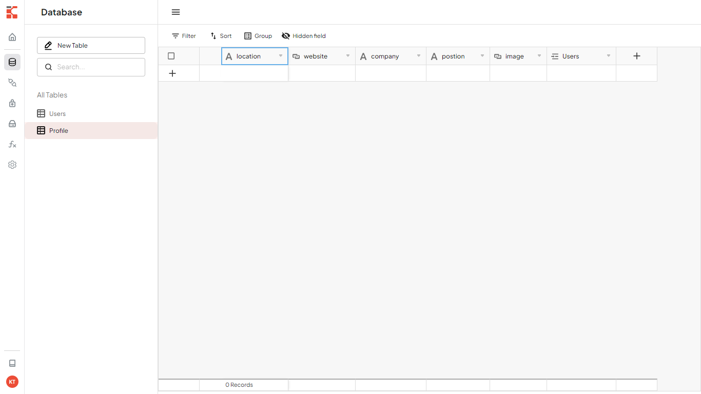

<div class='container-link'>
  <a  class='button-stackblitz' href="https://stackblitz.com/fork/github/kontenbase/quickstart-solid">
    
  </a>
  <a class='button-link button-github' href='https://github.com/kontenbase/quickstart-solid'>View source
    
  </a>
</div>

## Intro

This example will show you how to build a simple user management app from scratch using Kontenbase and Solid JS. Before begin make sure that you are familiar with Solid JS basics.

This also includes:

- Kontenbase [Database](/service/find): to store data, such as users and profiles.
- Kontenbase [SDK](/overview/sdk): this will make easier to handle auth and service features.
- Kontenbase [Authentication & Authorization](/auth/register): users can sign in with username and password.
- Kontenbase [Storage](/storage/upload): users can upload a photo.

By the end, you'll have an application that is able to register a new user, login and update some basic profile details.


## Project Set up

Before we start building we're going to set up our Database and get the API KEY.

### Create a Project

1. Go to [app.kontenbase.com](https://app.kontenbase.com)
2. Click on `Create Project` button.
3. Enter your project details.
4. Wait for the new project to launch.

### Set up the Database Service

Now we are going to set `profile` and `Users` service.

1. Click on `Create New Service` button.
2. Fill in the service detail, give a name `profile`, select as private.
3. Click on `profile` service, select`Customize Fields`, then add some fields following picture below. note, there is a field `Users` with data type `Link To Record`. It means we create a data relation between the service `profile` with the `Users`.



We need some configuration in `Users` service to make both autheticated user and public can get or access users data. But don't worry, by default that will not return password, so user still secure.

1. Click on `Authorization` button.
2. Change service to `Users` and turn on `GET` permission for role autheticated and public.


3. Add new field called : `username`, select data type : `username`, then set field as required and unique.
4. Enable username as user identity when logging in: click `Settings`, then `Configuration` on the sidebar, find `User identity field` and change to username.

### Get the API KEY

1. Go to the `Settings`.
2. Click `API` on the sidebar.
3. Find your API KEY in this page.

### Building the App

#### Initialize a Solid App

We use Vite template to initialize a Solid App called kontenbase-solid:

```cmd
npx degit solidjs/templates/js kontenbase-solid
cd kontenbase-solid
npm install
```

Let's install Kontenbase SDK and additional dependency @solidjs/router, simply use the command below:

```
npm install @kontenbase/sdk @solidjs/router
```

Save the API KEY to environment variable. create `.env` file inside the root folder.

```cmd title=".env"
VITE_KONTENBASE_API_KEY=YOUR_API_KEY
```

Once that is done, let's create a helper file to initialize the Kontenbase Client and configure your SDK with the API KEY:

```js title="/src/lib/kontenbase.js"
import { KontenbaseClient } from "@kontenbase/sdk";

export const kontenbase = new KontenbaseClient({
  apiKey: import.meta.env.VITE_KONTENBASE_API_KEY,
});
```

An optional step is updating the CSS file on src/index.css to make the App look nice. Remove everything from the src/index.css and copy the css code that we have provided below:

```css title='/src/index.css'
@import url("https://fonts.googleapis.com/css2?family=Rubik:wght@300;400;500;600;700&display=swap");

* {
  margin: 0;
  padding: 0;
  box-sizing: border-box;
  font-family: "Rubik", sans-serif;
}
button {
  background-color: transparent;
  border: none;
  padding: 8px 12px;
  font-size: 16px;
  cursor: pointer;
}
.button-ouline {
  border: 1px solid gainsboro;
}
.button-primary {
  background-color: black;
  color: white;
}
.auth-page {
  margin: 0 auto;
  width: 560px;
  padding: 14px;
}
.auth-button {
  text-align: right;
  margin-bottom: 16px;
}
.auth-page h2 {
  text-align: center;
}
.form-group {
  margin-bottom: 12px;
  font-size: 16px;
}
.form-group label {
  display: block;
  margin-bottom: 4px;
  font-weight: 500;
  font-size: 16px;
}
.form-group input {
  padding: 8px 12px;
  width: 100%;
  font-size: 16px;
}
.form-button {
  text-align: right;
}
.profile-page {
  margin: 0 auto;
  width: 560px;
}
.profile-wrapper {
  background-color: black;
  padding: 14px;
  color: white;
}
.profile-header {
  text-align: center;
  padding: 24px 0;
}
.profile-title {
  margin: 8px 0;
  font-size: 24px;
  font-weight: 600;
  text-transform: capitalize;
}
.image-avatar {
  border-radius: 50px;
}
.card {
  background-color: white;
  color: black;
  border-radius: 2px;
  padding: 14px;
}
.card:not(:last-child) {
  margin-bottom: 12px;
}
.card h3 {
  font-weight: 500;
  margin-bottom: 24px;
}
.card-field:not(:last-child) {
  margin-bottom: 12px;
}
.card-field input {
  font-size: 16px;
}
.card span,
.card label {
  display: block;
  font-size: 14px;
  color: gray;
  margin-bottom: 4px;
}
.card input {
  display: block;
  font-family: 16px;
  padding: 8px 8px 8px 0;
  color: black;
  width: 100%;
  border: none;
  border-bottom: 1px solid gainsboro;
  outline: none;
}
.website-link {
  text-decoration: none;
  color: black;
}
.logout-button {
  text-align: end;
}
input[type="file"] {
  display: none;
}
.label-file {
  display: flex;
  flex-direction: column;
  align-items: center;
  margin-top: 2px;
  cursor: pointer;
}
.label-file span {
  margin-top: 10px;
}
.button-top {
  display: flex;
  justify-content: space-between;
}
.link-email {
  text-decoration: none;
  color: black;
}
```

#### Set up Login and Register Components

Let's set up the solid components to manage login and register. We'll use username and password to login.

Create the folders inside the src which will be called `pages` and `components`, then create `Login.jsx` and `Register.jsx` file inside the `components` folder and copy the code below in each files.

```js title='/src/components/Login.jsx'
import { createSignal } from "solid-js";
import { useNavigate } from "@solidjs/router";
import { kontenbase } from "../lib/kontenbase";

const Login = () => {
  const navigate = useNavigate();
  const [username, setUsername] = createSignal("");
  const [password, setPassword] = createSignal("");

  const handleLogin = async (e) => {
    e.preventDefault();

    const { error } = await kontenbase.auth.login({
      username: username(),
      password: password(),
    });

    if (error) {
      alert(error.message);
      return;
    }

    navigate("/profile");
  };

  return (
    <div>
      <form onSubmit={handleLogin}>
        <h2>Login</h2>
        <div class="form-group">
          <label>Username</label>
          <input
            type="text"
            value={username()}
            onChange={(e) => setUsername(e.target.value)}
          />
        </div>
        <div class="form-group">
          <label>Password</label>
          <input
            type="password"
            value={password()}
            onChange={(e) => setPassword(e.target.value)}
          />
        </div>
        <div class="form-button">
          <button class="button button-primary" type="sumbit">
            Submit
          </button>
        </div>
      </form>
    </div>
  );
};

export default Login;
```

```js title='/src/components/Register.jsx'
import { createSignal, createEffect } from "solid-js";
import { useNavigate } from "@solidjs/router";
import { kontenbase } from "../lib/kontenbase";

const Register = () => {
  const navigate = useNavigate();

  const [firstName, setFirstName] = createSignal("");
  const [lastName, setLastName] = createSignal("");
  const [username, setUsername] = createSignal("");
  const [email, setEmail] = createSignal("");
  const [password, setPassword] = createSignal("");

  const handleRegister = async (e) => {
    e.preventDefault();

    const { user, error } = await kontenbase.auth.register({
      firstName: firstName(),
      lastName: lastName(),
      username: username(),
      email: email(),
      password: password(),
    });

    if (error) {
      alert(error.message);
      return;
    }

    const { error: ErrorProfile } = await kontenbase.service("profile").create({
      Users: [user._id],
    });

    if (ErrorProfile) {
      alert(ErrorProfile.message);
      return;
    }

    navigate("/profile");
  };

  return (
    <div>
      <form onSubmit={handleRegister}>
        <h2>Register</h2>
        <div className="form-group">
          <label>First Name</label>
          <input
            type="text"
            value={firstName()}
            onChange={(e) => setFirstName(e.target.value)}
          />
        </div>
        <div className="form-group">
          <label>Last Name</label>
          <input
            type="text"
            value={lastName()}
            onChange={(e) => setLastName(e.target.value)}
          />
        </div>
        <div className="form-group">
          <label>Username</label>
          <input
            type="text"
            value={username()}
            onChange={(e) => setUsername(e.target.value)}
          />
        </div>
        <div className="form-group">
          <label>Email</label>
          <input
            type="text"
            value={email()}
            onChange={(e) => setEmail(e.target.value)}
          />
        </div>
        <div className="form-group">
          <label>Password</label>
          <input
            type="password"
            value={password()}
            onChange={(e) => setPassword(e.target.value)}
          />
        </div>
        <div className="form-button">
          <button className="button button-primary" type="sumbit">
            Submit
          </button>
        </div>
      </form>
    </div>
  );
};

export default Register;
```

Create `Auth.jsx` file inside the `pages` folder, this will import `Login` and `Register` components. Copy the code below:

```js title='/src/pages/Auth.jsx'
import { createSignal, createEffect } from "solid-js";
import { useNavigate } from "@solidjs/router";
import { kontenbase } from "../lib/kontenbase";

import Login from "../components/Login";
import Register from "../components/Register";

const Auth = () => {
  const navigate = useNavigate();
  const [switchAuthForm, setSwitchAuthForm] = createSignal("login");

  createEffect(() => {
    (async () => {
      const { error } = await kontenbase.auth.user();

      if (error) {
        console.log(error);
        return;
      }

      navigate("/profile");
    })();
  }, []);

  const handleRegisterForm = () => {
    setSwitchAuthForm("register");
  };

  const handleLoginForm = () => {
    setSwitchAuthForm("login");
  };

  return (
    <div className="auth-page">
      <div className="auth-button">
        <button onClick={handleLoginForm}>Login</button>
        <button onClick={handleRegisterForm}>Register</button>
      </div>
      {switchAuthForm() === "register" ? <Register /> : <Login />}
    </div>
  );
};

export default Auth;
```

Create a route for Auth page, then launch App.

```js title='/src/App.jsx'
import { Router, Routes, Route } from "@solidjs/router";

import Auth from "./pages/Auth";

function App() {
  return (
    <Router>
      <Routes>
        <Route path="/" element={<Auth />} />
      </Routes>
    </Router>
  );
}

export default App;
```

This is what we will see after doing the steps above.


#### Set up Profile Page

To view and edit our profile, let's create `EditProfile.jsx` file inside the `pages` folder, then copy the code below:

```js title='/src/pages/EditProfile.jsx'
import { createSignal, createEffect } from "solid-js";
import { useNavigate } from "@solidjs/router";
import { kontenbase } from "../lib/kontenbase";

const EditProfile = () => {
  const navigate = useNavigate();
  const [firstName, setFirstName] = createSignal("");
  const [lastName, setLastName] = createSignal("");
  const [phoneNumber, setPhoneNumber] = createSignal("");
  const [username, setUsername] = createSignal("");
  const [profileId, setProfileId] = createSignal("");
  const [image, setImage] = createSignal("");
  const [company, setCompany] = createSignal("");
  const [position, setPosition] = createSignal("");
  const [location, setLocation] = createSignal("");
  const [website, setWebsite] = createSignal("");
  const [loading, setLoading] = createSignal(false);

  createEffect(() => {
    (async () => {
      const { user, error } = await kontenbase.auth.user({
        lookup: "*",
      });

      if (error) {
        console.log(error);
        return;
      }

      const profile = user?.profile?.[0];

      setFirstName(user?.firstName);
      setLastName(user?.lastName);
      setPhoneNumber(user?.phoneNumber);
      setUsername(user?.username);
      setProfileId(profile?._id);
      setImage(profile?.image);
      setCompany(profile?.company);
      setLocation(profile?.location);
      setPosition(profile?.position);
      setWebsite(profile?.website);
    })();
  }, []);

  const handleViewProfile = () => {
    navigate(`/${username()}`);
  };

  const handleLogout = async () => {
    const { error } = await kontenbase.auth.logout();

    if (error) {
      console.log(error);
      return;
    }

    navigate("/");
  };

  const handleChangeImage = async (e) => {
    setLoading(true);

    const file = e.target.files[0];
    const { data, error: uploadError } = await kontenbase.storage.upload(file);
    const { error: updateError } = await kontenbase
      .service("profile")
      .updateById(profileId(), {
        image: data?.url,
      });

    if (uploadError || updateError) {
      alert("Failed to change image profile");
      return;
    }

    setImage(data?.url);
    setLoading(false);
  };

  const handleUpdate = async (e) => {
    e.preventDefault();

    const { error: userError } = await kontenbase.auth.update({
      firstName: firstName(),
      lastName: lastName(),
      phoneNumber: phoneNumber(),
    });
    const { error: profileError } = await kontenbase
      .service("profile")
      .updateById(profileId(), {
        company: company(),
        location: location(),
        position: position(),
        website: website(),
      });

    if (userError || profileError) {
      alert("Failed to update profile");
    } else {
      alert("Profile updated!");
    }
  };

  return (
    <div className="profile-page">
      <div className="button-top">
        <button onClick={handleViewProfile}>View Profile</button>
        <button onClick={handleLogout}>Logout</button>
      </div>
      <div className="profile-wrapper">
        <div className="profile-header">
          <label className="label-file" htmlFor="file">
            
            <span>{loading() ? "Uploading..." : "Change Image"}</span>
          </label>
          <input onChange={handleChangeImage} id="file" type="file" />
        </div>
        <div className="card">
          <form onSubmit={handleUpdate}>
            <div className="card-field">
              <label>First Name</label>
              <input
                type="text"
                value={firstName()}
                onChange={(e) => setFirstName(e.target.value) || ""}
              />
            </div>
            <div className="card-field">
              <label>Last Name</label>
              <input
                type="text"
                value={lastName()}
                onChange={(e) => setLastName(e.target.value) || ""}
              />
            </div>
            <div className="card-field">
              <label>Phone Number</label>
              <input
                type="text"
                value={phoneNumber() || ""}
                onChange={(e) => setPhoneNumber(e.target.value)}
              />
            </div>
            <div className="card-field">
              <label>Company</label>
              <input
                type="text"
                value={company() || ""}
                onChange={(e) => setCompany(e.target.value)}
              />
            </div>
            <div className="card-field">
              <label>Position</label>
              <input
                type="text"
                value={position() || ""}
                onChange={(e) => setPosition(e.target.value)}
              />
            </div>
            <div className="card-field">
              <label>Location</label>
              <input
                type="text"
                value={location() || ""}
                onChange={(e) => setLocation(e.target.value)}
              />
            </div>

            <div className="card-field">
              <label>Website</label>
              <input
                type="url"
                value={website() || ""}
                onChange={(e) => setWebsite(e.target.value)}
              />
            </div>
            <div className="form-button">
              <button type="submit" className="button button-primary">
                Update
              </button>
            </div>
          </form>
        </div>
      </div>
    </div>
  );
};

export default EditProfile;
```

Create a route for Profile page.

```js title='/src/App.jsx'
import { Router, Routes, Route } from "@solidjs/router";

import Auth from "./pages/Auth";
// highlight-start
import EditProfile from "./pages/EditProfile";
// highlight-end

const App = () => {
  return (
    <BrowserRouter>
      <Routes>
        <Route path="/" element={<Auth />} />
        // highlight-start
        <Route path="/profile" element={<EditProfile />} />
        // highlight-end
      </Routes>
    </BrowserRouter>
  );
};

export default App;
```

If we register or login successfully we should be navigated to `Profile` page. In this page we will able to edit profile and upload a picture.


#### Set up View Profile Based on the Username

Now we will create a page to show user profile based on the username defined in the URL. Example when user visit: `app_url/johndoe`,
this page will show user profile with username `johndoe`.

Create `Profile.jsx` file inside the `pages` folder, Copy the code below:

```js title='/src/pages/Profile.jsx'
import { createSignal, createEffect } from "solid-js";
import { useNavigate, useParams } from "@solidjs/router";
import { kontenbase } from "../lib/kontenbase";

const Profile = () => {
  const navigate = useNavigate();

  const { username } = useParams();
  const [authUsername, setAuthUsername] = createSignal("");
  const [user, setUser] = createSignal();

  createEffect(() => {
    (async () => {
      const { user, error } = await kontenbase.auth.user({
        lookup: "*",
      });

      if (error) {
        console.log(error);
        return;
      }

      setAuthUsername(user?.username);
    })();
  }, []);

  createEffect(() => {
    (async () => {
      if (!username) {
        return;
      }

      const { data, error } = await kontenbase.service("Users").find({
        where: {
          username,
        },
        lookup: "*",
      });

      if (error) {
        console.log(error);
        return;
      }

      setUser(data?.[0]);
    })();
  }, [username]);

  const handleEditProfile = () => {
    navigate("/profile");
  };

  const handleLogout = async () => {
    const { error } = await kontenbase.auth.logout();

    if (error) {
      console.log(error);
      return;
    }

    navigate("/");
  };

  return (
    <>
      {user() && (
        <div className="profile-page">
          {authUsername() === username && (
            <div className="button-top">
              <button onClick={handleEditProfile}>Edit Profile</button>
              <button onClick={handleLogout}>Logout</button>
            </div>
          )}
          <div className="profile-wrapper">
            <div className="profile-header">
              
              <h3 className="profile-title">
                <span>{user().firstName}</span>{" "}
                <span>{user().lastName ?? ""}</span>
              </h3>
              <p>{user().profile?.[0]?.position ?? "position is null"}</p>
            </div>
            <div className="card">
              <h3>Contact</h3>
              <div className="card-field">
                <span>Name</span>
                <p>
                  {user().firstName} {user().lastName ?? ""}
                </p>
              </div>
              <div className="card-field">
                <span>Mobile</span>
                <p>{user().phoneNumber ?? "phone number is null"}</p>
              </div>
              <div className="card-field">
                <span>Email</span>
                <a className="link-email" href="mailto:name@email.com">
                  {user().email}
                </a>
              </div>
              <div className="card-field">
                <span>Company</span>
                <p>{user().profile?.[0]?.company ?? "company is null"}</p>
              </div>
            </div>
            <div className="card">
              <h3>Location</h3>
              <p>{user().profile?.[0]?.location ?? "location is null"}</p>
            </div>
            <div className="card">
              <h3>Web Links</h3>
              <a
                className="website-link"
                href={user().profile?.[0]?.website ?? ""}
              >
                Website
              </a>
            </div>
          </div>
        </div>
      )}
    </>
  );
};

export default Profile;
```

Finally, create a route for this page.

```js title='/src/App.jsx'
import { Router, Routes, Route } from "@solidjs/router";

import Auth from "./pages/Auth";
import EditProfile from "./pages/EditProfile";
//highlight-start
import Profile from "./pages/Profile";
//highlight-end

const App = () => {
  return (
    <BrowserRouter>
      <Routes>
        <Route path="/" element={<Auth />} />
        <Route path="/profile" element={<EditProfile />} />
        //highlight-start
        <Route path="/:username" element={<Profile />} />
        //highlight-end
      </Routes>
    </BrowserRouter>
  );
};

export default App;
```

And we're done to complete our App!
