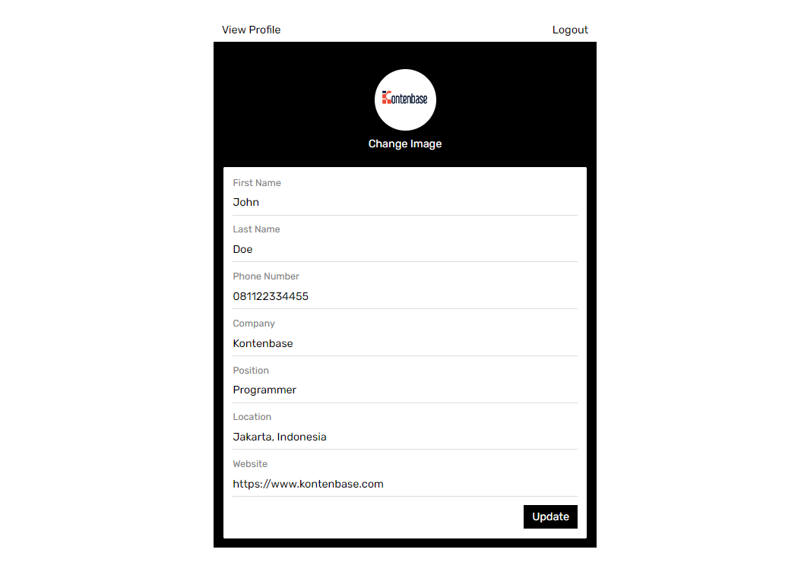
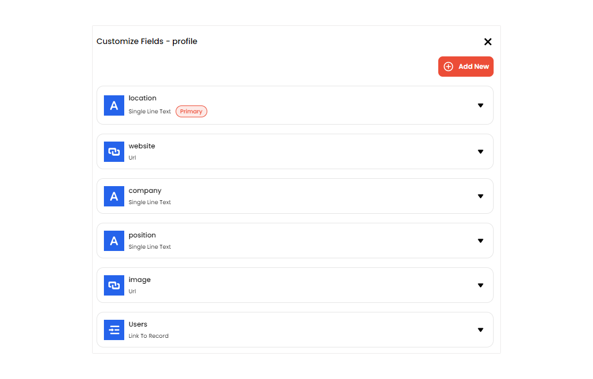
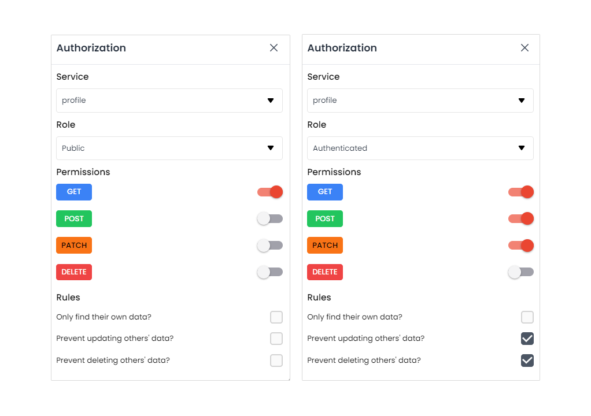

<div class='container-link'>
  <a  class='button-stackblitz' href="https://stackblitz.com/fork/github/kontenbase/quickstart-vue">
    
  </a>
  <a class='button-link button-github' href='https://github.com/kontenbase/quickstart-vue'>View source
    
  </a>
</div>

## Intro

This example will show you how to build a simple user management app from scratch using Kontenbase and Vue. Before begin make sure that you are familiar with Vue basics.

This also includes:

- Kontenbase [Database](/service/find): to store data, such as users and profiles.
- Kontenbase [SDK](/overview/sdk): this will make easier to handle auth and service features.
- Kontenbase [Authentication & Authorization](/auth/register): users can sign in with username and password.
- Kontenbase [Storage](/storage/upload): users can upload a photo.

By the end, you'll have an application that is able to register a new user, login and update some basic profile details.



## Project Set up

Before we start building we're going to set up our Database and get the API KEY.

### Create a Project

1. Go to [app.kontenbase.com](https://app.kontenbase.com)
2. Click on `Create Project` button.
3. Enter your project details.
4. Wait for the new project to launch.

### Set up the Database Service

Now we are going to set `profile` and `Users` service.

1. Click on `Create New Service` button.
2. Fill in the service detail, give a name `profile`, select as private.
3. Click on `profile` service, select`Customize Fields`, then add some fields following picture below. note, there is a field `Users` with data type `Link To Record`. It means we create a data relation between the service `profile` with the `Users`.



We need some configuration in `Users` service to make both autheticated user and public can get or access users data. But don't worry, by default that will not return password, so user still secure.

1. Click on `Authorization` button.
2. Change service to `Users` and turn on `GET` permission for role autheticated and public.



3. Add new field called : `username`, select data type : `username`, then set field as required and unique.
4. Enable username as user identity when logging in: click `Settings`, then `Configuration` on the sidebar, find `User identity field` and change to username.

### Get the API KEY

1. Go to the `Settings`.
2. Click `API` on the sidebar.
3. Find your API KEY in this page.

### Building the App

#### Initialize a Vue App

We use Vite template to initialize a Vue app called kontenbase-vue:

```cmd
npm create vite@latest kontenbase-vue -- --template vue
cd kontenbase-vue
npm install
```

Let's install Kontenbase SDK and additional dependency vue-router simply use the command below:

```
npm install @kontenbase/sdk vue-router
```

Save the API KEY to environment variable in a `.env` that you copied earlier.

```cmd title=".env"
VITE_KONTENBASE_API_KEY=YOUR_KONTENBASE_API_KEY
```

Once that is done, let's create a helper file to initialize the Kontenbase Client and configure your SDK with the API KEY:

```js title="/src/lib/kontenbase.js"
import { KontenbaseClient } from '@kontenbase/sdk';

export const kontenbase = new KontenbaseClient({
  apiKey: import.meta.env.VITE_KONTENBASE_API_KEY,
});
```

An optional step is updating the CSS file to make the App look nice. Remove everything from the `style.css` and copy the css code that we have provided below:

```css title='/src/style.css'
@import url('https://fonts.googleapis.com/css2?family=Rubik:wght@300;400;500;600;700&display=swap');

* {
  margin: 0;
  padding: 0;
  box-sizing: border-box;
  font-family: 'Rubik', sans-serif;
}
a {
  text-decoration: none;
}
button,
.button {
  color: black;
  background-color: transparent;
  border: none;
  padding: 8px 12px;
  font-size: 16px;
  cursor: pointer;
}
.button-ouline {
  border: 1px solid gainsboro;
}
.button-primary {
  background-color: black;
  color: white;
}
.auth-page {
  margin: 0 auto;
  width: 560px;
  padding: 14px;
}
.auth-button {
  text-align: right;
  margin-bottom: 16px;
}
.auth-page h2 {
  text-align: center;
}
.form-group {
  margin-bottom: 12px;
  font-size: 16px;
}
.form-group label {
  display: block;
  margin-bottom: 4px;
  font-weight: 500;
  font-size: 16px;
  text-align: left;
}
.form-group input {
  padding: 8px 12px;
  width: 100%;
  font-size: 16px;
}
.form-button {
  text-align: right;
}
.profile-page {
  margin: 0 auto;
  width: 560px;
}
.profile-wrapper {
  background-color: black;
  padding: 14px;
  color: white;
}
.profile-header {
  text-align: center;
  padding: 24px 0;
}
.profile-title {
  margin: 8px 0;
  font-size: 24px;
  font-weight: 600;
  text-transform: capitalize;
}
.image-avatar {
  border-radius: 50px;
}
.card {
  background-color: white;
  color: black;
  border-radius: 2px;
  padding: 14px;
}
.card:not(:last-child) {
  margin-bottom: 12px;
}
.card h3 {
  font-weight: 500;
  margin-bottom: 24px;
}
.card-field:not(:last-child) {
  margin-bottom: 12px;
}
.card-field input {
  font-size: 16px;
}
.card span,
.card label {
  display: block;
  font-size: 14px;
  color: gray;
  margin-bottom: 4px;
}
.card input {
  display: block;
  font-family: 16px;
  padding: 8px 8px 8px 0;
  color: black;
  width: 100%;
  border: none;
  border-bottom: 1px solid gainsboro;
  outline: none;
}
.website-link {
  text-decoration: none;
  color: black;
}
.logout-button {
  text-align: end;
}
input[type='file'] {
  display: none;
}
.label-file {
  display: flex;
  flex-direction: column;
  align-items: center;
  margin-top: 2px;
  cursor: pointer;
}
.label-file span {
  margin-top: 10px;
}
.button-top {
  display: flex;
  justify-content: space-between;
}
.link-email {
  text-decoration: none;
  color: black;
}
```

#### Set up Login and Register Components

Let's set up the vue components to manage login and register. We'll use username and password to login.
Create the folders inside the src which will be called `views` and `components`, then create `Login.vue` and `Register.vue` file inside the `components` folder and copy the code below in each files.

```js title='/src/components/Login.vue'
<template>
  <form @submit.prevent="handleLogin">
    <input type="hidden" name="operation" value="login" />
    <div class="form-group">
      <label>Username</label>
      <input type="text" name="username" required v-model="username" />
    </div>
    <div class="form-group">
      <label>Password</label>
      <input type="password" name="password" required v-model="password" />
    </div>
    <div class="form-button">
      <button class="button button-primary">Submit</button>
    </div>
  </form>
</template>

<script>
import { ref } from 'vue';
import { kontenbase } from '../lib/kontenbase';
import { useRouter } from 'vue-router';

export default {
  setup() {
    const router = useRouter();
    const username = ref('');
    const password = ref('');

    const handleLogin = async () => {
      const { error, token } = await kontenbase.auth.login({
        username: username.value,
        password: password.value,
      });

      if (error) {
        alert(error.message);
        return;
      }

      if (token) {
        router.push('/profile');
      }
    };

    return {
      username,
      password,
      handleLogin,
    };
  },
};
</script>
```

```js title='/src/components/Register.vue'
<template>
  <form @submit.prevent="handleRegister">
    <div class="form-group">
      <label>First Name</label>
      <input type="text" name="firstname" required v-model="firstName" />
    </div>
    <div class="form-group">
      <label>Last Name</label>
      <input type="text" name="lastname" v-model="lastName" />
    </div>
    <div class="form-group">
      <label>Username</label>
      <input type="text" name="username" required v-model="username" />
    </div>
    <div class="form-group">
      <label>Email</label>
      <input type="email" name="email" required v-model="email" />
    </div>
    <div class="form-group">
      <label>Password</label>
      <input type="password" name="password" required v-model="password" />
    </div>
    <div class="form-button">
      <button class="button button-primary">Submit</button>
    </div>
  </form>
</template>

<script>
import { ref } from 'vue';
import { kontenbase } from '../lib/kontenbase';
import { useRouter } from 'vue-router';

export default {
  setup() {
    const router = useRouter();
    const firstName = ref('');
    const lastName = ref('');
    const username = ref('');
    const email = ref('');
    const password = ref('');

    const handleRegister = async () => {
      const { user, error } = await kontenbase.auth.register({
        firstName: firstName.value,
        lastName: lastName.value,
        username: username.value,
        email: email.value,
        password: password.value,
      });

      if (error) {
        alert(error.message);
        return;
      }

      const { error: ErrorProfile } = await kontenbase
        .service('profile')
        .create({
          Users: [user._id],
        });

      if (ErrorProfile) {
        alert(ErrorProfile.message);
        return;
      }

      router.push('/profile');
    };

    const handleLogout = async () => {
      const { error } = await kontenbase.auth.logout();

      if (error) {
        console.log(error);
        return;
      }

      router.push('/');
    };

    return {
      firstName,
      lastName,
      username,
      email,
      password,
      handleRegister,
      handleLogout,
    };
  },
};
</script>

```

Create `Home.vue` file inside the `views` folder, this will import `Login` and `Register` components. Copy the code below:

```js title='/src/views/Home.vue'
<script setup>
import Login from '../components/Login.vue';
import Register from '../components/Register.vue';
</script>
<template>
  <div class="auth-page">
    <div class="auth-button">
      <button @click="switchAuthForm = 'login'">Login</button>
      <button @click="switchAuthForm = 'register'">Register</button>
      <div v-if="switchAuthForm === 'login'">
        <Login />
      </div>
      <div v-else>
        <Register />
      </div>
    </div>
  </div>
</template>

<script>
export default {
  data() {
    return {
      switchAuthForm: 'login',
    };
  },
};
</script>
```

Now configure router for our app.
Create a folder called `router` in the `src` folder, followed by a file called `index.js` in the `router` folder, copy the code below which is the router configuration.

```js title='/src/router/index.js'
import { createRouter, createWebHistory } from 'vue-router';
import Home from '../views/Home.vue';

const routes = [
  {
    path: '/',
    component: Home,
  },
];

const router = createRouter({
  history: createWebHistory(),
  routes,
});

export default router;
```

then replace the code in the `App.vue` with the code bellow.

```js title='/src/App.vue'
<template>
  <router-view></router-view>
</template>

<script>
export default {
  name: 'App',
};
</script>
```

If we launch the App after doing the steps above, We'll see this page show:


#### Set up Profile Page

To view and edit our profile, let's create `EditProfile.vue` file inside the `views` folder, then copy the code below:

```js title='/src/views/EditProfile.vue'
<template>
  <div class="profile-page">
    <div class="button-top">
      <router-link class="button" :to="username">View Profile</router-link>
      <button @click="handleLogout">Logout</button>
    </div>
    <div class="profile-wrapper">
      <div class="profile-header">
        <label class="label-file" htmlFor="file">
          
          <span v-if="loading">Uploading...</span>
          <span v-else="loading">Change Image</span>
        </label>
        <input
          name="file"
          id="file"
          type="file"
          accept="image/*"
          @change="handleChangeImage"
        />
      </div>
      <div class="card">
        <form method="post" @submit.prevent="handleUpdate">
          <div class="card-field">
            <label>First Name</label>
            <input type="text" name="firstname" v-model="firstName" />
          </div>
          <div class="card-field">
            <label>Last Name</label>
            <input type="text" name="lastname" v-model="lastName" />
          </div>
          <div class="card-field">
            <label>Phone Number</label>
            <input type="text" name="phonenumber" v-model="phoneNumber" />
          </div>
          <div class="card-field">
            <label>Company</label>
            <input type="text" name="company" v-model="company" />
          </div>
          <div class="card-field">
            <label>Position</label>
            <input type="text" name="position" v-model="position" />
          </div>
          <div class="card-field">
            <label>Location</label>
            <input type="text" name="location" v-model="location" />
          </div>
          <div class="card-field">
            <label>Website</label>
            <input type="url" name="website" v-model="website" />
          </div>
          <div class="form-button">
            <button type="submit" class="button button-primary">Update</button>
          </div>
        </form>
      </div>
    </div>
  </div>
</template>

<script>
import { onMounted, ref } from 'vue';
import { kontenbase } from '../lib/kontenbase';
import { useRouter } from 'vue-router';

export default {
  setup() {
    const router = useRouter();
    const firstName = ref('');
    const lastName = ref('');
    const phoneNumber = ref('');
    const username = ref('');
    const profileId = ref('');
    const image = ref('');
    const company = ref('');
    const position = ref('');
    const location = ref('');
    const website = ref('');
    const loading = ref(false);

    const getProfile = async () => {
      const { user, error } = await kontenbase.auth.user({
        lookup: '*',
      });

      if (error) {
        console.log(error);
        return;
      }

      if (user) {
        const profile = user?.profile?.[0];

        firstName.value = user.firstName;
        lastName.value = user.lastName;
        phoneNumber.value = user.phoneNumber;
        username.value = user.username;
        profileId.value = profile._id;
        image.value = profile.image;
        company.value = profile.company;
        location.value = profile.location;
        position.value = profile.position;
        website.value = profile.website;
      }
    };

    const handleChangeImage = async (e) => {
      loading.value = true;
      const file = e.target.files[0];
      console.log(file);
      const { data, error: uploadError } = await kontenbase.storage.upload(
        file
      );

      const { error: updateError } = await kontenbase
        .service('profile')
        .updateById(profileId.value, {
          image: data?.url,
        });

      if (uploadError || updateError) {
        alert('Failed to change image profile');
        return;
      }

      image.value = data?.url;
      loading.value = false;
    };

    const handleUpdate = async () => {
      const { error: userError } = await kontenbase.auth.update({
        lastName: lastName.value,
        firstName: firstName.value,
        phoneNumber: phoneNumber.value,
      });
      const { error: profileError } = await kontenbase
        .service('profile')
        .updateById(profileId.value, {
          company: company.value,
          location: location.value,
          position: position.value,
          website: website.value,
        });

      if (userError || profileError) {
        alert('Failed to update profile');
      } else {
        alert('Profile updated!');
      }
    };

    const handleLogout = async () => {
      const { error } = await kontenbase.auth.logout();

      if (error) {
        console.log(error);
        return;
      }

      router.push('/');
    };

    onMounted(() => {
      getProfile();
    });

    return {
      firstName,
      lastName,
      phoneNumber,
      username,
      profileId,
      image,
      company,
      location,
      position,
      website,
      loading,
      handleChangeImage,
      handleUpdate,
      handleLogout,
    };
  },
};
</script>
```

Create a route for Edit Profile page.

```js title='/src/router/index.js'
import { createRouter, createWebHistory } from 'vue-router';
import Home from '../views/Home.vue';
// highlight-start
import EditProfile from '../views/EditProfile.vue';
// highlight-end

const routes = [
  {
    path: '/',
    component: Home,
  },
  // highlight-start
  {
    path: '/profile',
    component: EditProfile,
  },
  // highlight-end
];

const router = createRouter({
  history: createWebHistory(),
  routes,
});

export default router;
```

If we register or login successfully we should be navigated to `Profile` page. In this page we will able to edit profile and upload a picture.


#### Set up View Profile Based on the Username

Now we will create a page to show user profile based on the username defined in the URL. Example when user visit: `app_url/johndoe`,
this page will show user profile with username `johndoe`.

Create `Profile.vue` file inside the `views` folder, Copy the code below:

```js title='/src/views/Profile.js'
<template>
  <div class="profile-page">
    <div v-if="isOwnProfile" class="button-top">
      <router-link class="button" to="/profile">Edit Profile</router-link>
      <button @click="handleLogout">Logout</button>
    </div>
    <div class="profile-wrapper">
      <div class="profile-header">
        
        <h3 class="profile-title">
          <span>{{ firstName }}</span> <span>{{ lastName }}</span>
        </h3>
        <p>{{ position || 'position is null' }}</p>
      </div>
      <div class="card">
        <h3>Contact</h3>
        <div class="card-field">
          <span>Name</span>
          <p>{{ firstName }} {{ lastName }}</p>
        </div>
        <div class="card-field">
          <span>Mobile</span>
          <p>{{ phoneNumber || 'phone number is null' }}</p>
        </div>
        <div class="card-field">
          <span>Email</span>
          <a class="link-email" :href="'mailto:' + email">
            {{ email || 'email is null' }}
          </a>
        </div>
        <div class="card-field">
          <span>Company</span>
          <p>{{ company || 'company is null' }}</p>
        </div>
      </div>
      <div class="card">
        <h3>Location</h3>
        <p>{{ location || 'location is null' }}</p>
      </div>
      <div class="card">
        <h3>Web Links</h3>
        <a class="website-link" href="{{ website || '' }}"> Website </a>
      </div>
    </div>
  </div>
</template>

<script>
import { onMounted, ref } from 'vue';
import { kontenbase } from '../lib/kontenbase';
import { useRouter, useRoute } from 'vue-router';
export default {
  setup() {
    const router = useRouter();
    const route = useRoute();
    const firstName = ref('');
    const lastName = ref('');
    const phoneNumber = ref('');
    const email = ref('');
    const profileId = ref('');
    const image = ref('');
    const company = ref('');
    const position = ref('');
    const location = ref('');
    const website = ref('');
    const isOwnProfile = ref(false);

    const getProfile = async () => {
      const { username } = route.params;

      if (!username) {
        return;
      }

      const { data, error } = await kontenbase.service('Users').find({
        where: {
          username,
        },
        lookup: '*',
      });

      if (error) {
        console.log(error);
        return;
      }

      if (data) {
        const user = data?.[0];
        const profile = user?.profile?.[0];
        firstName.value = user.firstName;
        lastName.value = user.lastName;
        phoneNumber.value = user.phoneNumber;
        email.value = user.email;
        profileId.value = profile._id;
        image.value = profile.image;
        company.value = profile.company;
        location.value = profile.location;
        position.value = profile.position;
        website.value = profile.website;

        const { user: authUser } = await kontenbase.auth.user();

        isOwnProfile.value = user.username === authUser?.username;
      }
    };

    const handleLogout = async () => {
      const { error } = await kontenbase.auth.logout();

      if (error) {
        console.log(error);
        return;
      }

      router.push('/');
    };

    onMounted(() => {
      getProfile();
    });

    return {
      firstName,
      lastName,
      phoneNumber,
      email,
      profileId,
      image,
      company,
      location,
      position,
      website,
      isOwnProfile,
      handleLogout,
    };
  },
};
</script>
```

Create a route for Profile page.

```js title='/src/router/index.js'
import { createRouter, createWebHistory } from 'vue-router';
import Home from '../views/Home.vue';
import EditProfile from '../views/EditProfile.vue';
// highlight-start
import Profile from '../views/Profile.vue';
// highlight-end

const routes = [
  {
    path: '/',
    component: Home,
  },
  {
    path: '/profile',
    component: EditProfile,
  },
  // highlight-start
  {
    path: '/:username',
    component: Profile,
  },
  // highlight-end
];

const router = createRouter({
  history: createWebHistory(),
  routes,
});

export default router;
```

And we're done to complete our App!
